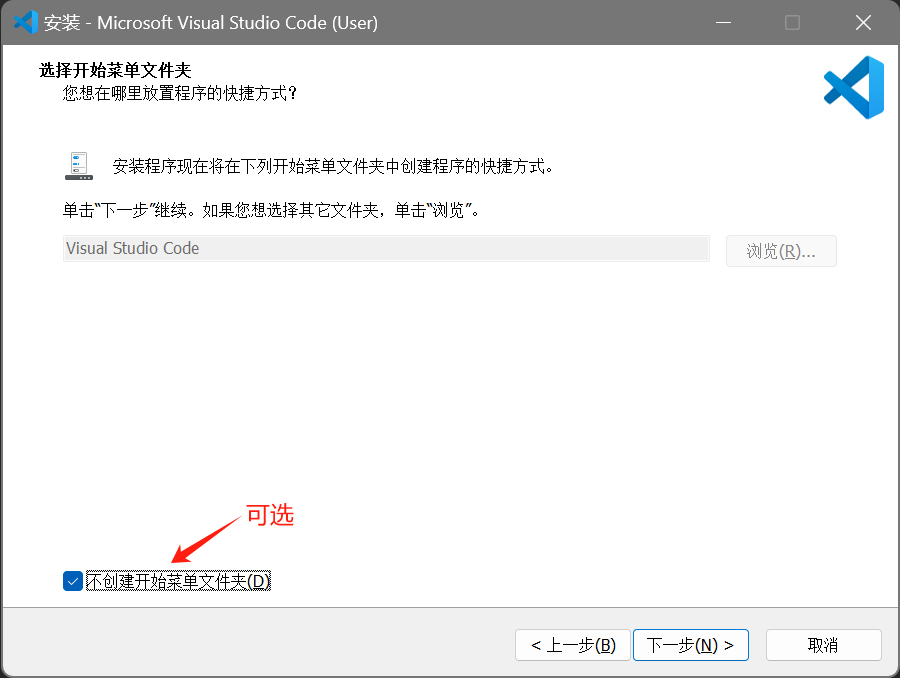
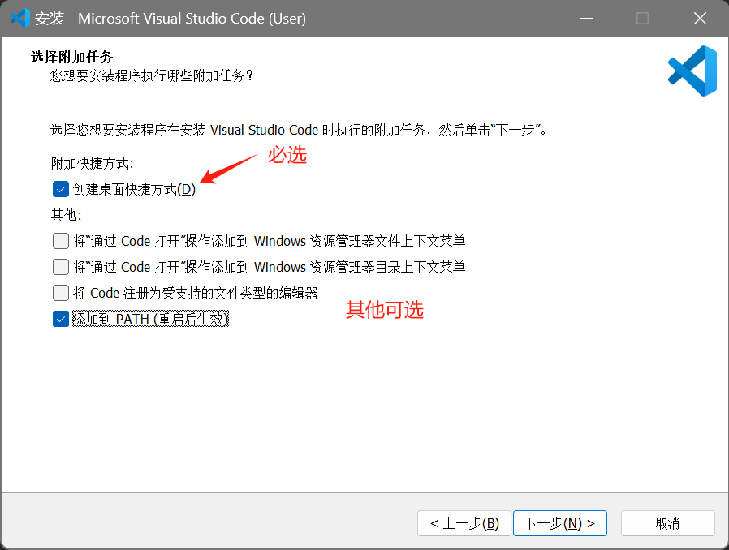
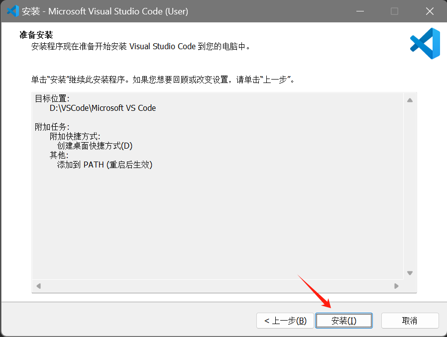
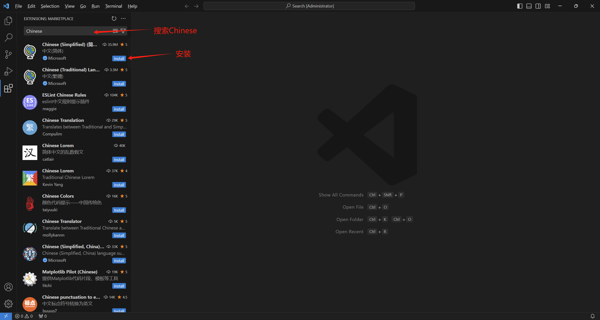
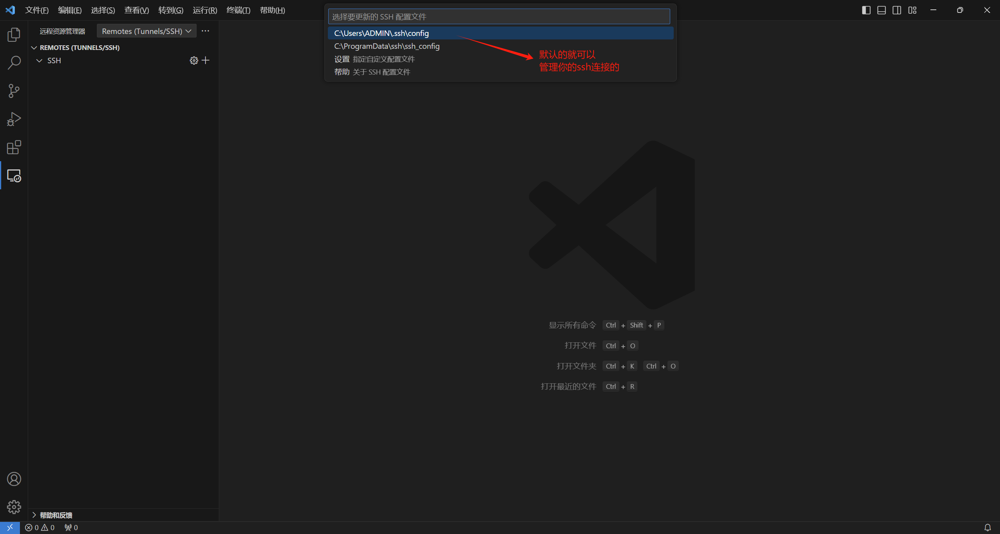
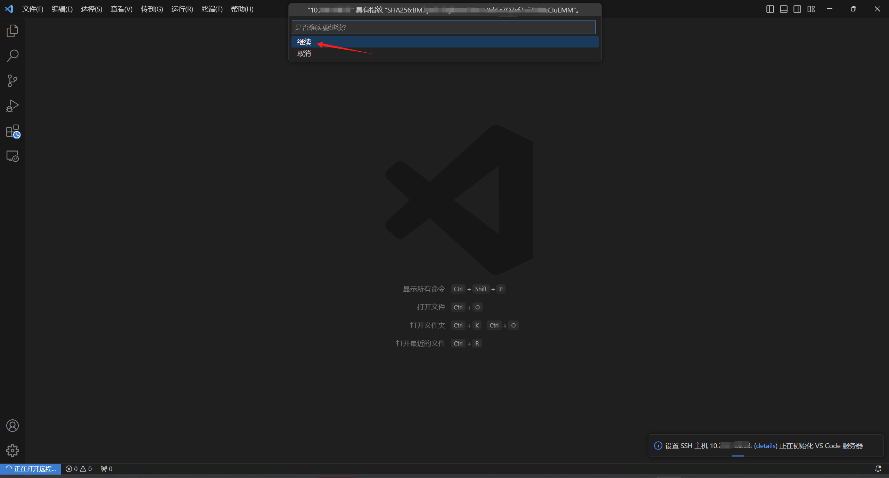
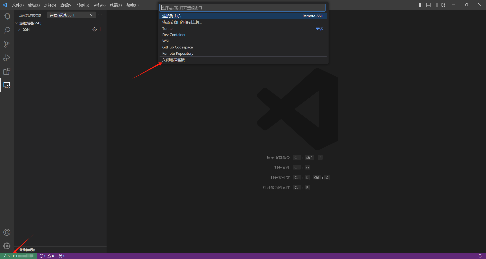

# 安装软件包

GCC 

原名 GNU C语言编译器 （GNU C Compiler）支持C

现名 GNU编译器套件  （GNU Compiler Collection）支持C、C++、...

GNU      GNU's Not Unix

GCC实际为一个程序

GCC  跨平台  （Linux，Windows，macOS，...）

MinGW-w64     GCC的Windows版本


安装 （都以 Ubuntu 为例）

```shell
$ sudo apt update                           更新软件包列表
$ sudo apt install bulid-essential          (gcc，g++, make, ...)
$ sudo apt install gdb
$ sudo apt install cmake

版本信息（安装成功确认）
$ gcc --version
$ g++ --version
$ gdb --version
$ cmake --version
```


# 编译过程

**源文件  →  预处理  →  编译  →  汇编  →  链接  →  可执行文件**

gcc 指令编译C代码，g++ 指令编译C++代码。 （以 gcc 演示，如果要使用 g++ ，直接替换 gcc 即可，操作是一样的）

<u>源文件</u>

源代码所在文件，后缀名为 .c （.cpp）

<u>头文件</u>

一般地，在 C 语言或 C++ 中，会把用来 #include 的文件的扩展名叫 .h，称其为头文件。

#include 文件的目的就是把多个编译单元(也就是 c 或者 cpp 文件)公用的内容，单独放在一个文件里减少整体代码尺寸；或者提供跨工程公共代码。


<u>预处理</u>

对源文件以 # 开头的命令进行处理（替换）

```shell
$ gcc -E hello.c -o hello.i

-E: 只对源文件执行预处理步骤，生成预处理后的.i文件
-o: 指定生成的文件名（若没有-o指定，则默认输出a.out文件）
```


<u>编译</u>

```shell
$ gcc -S hello.i -o hello.s

-S: 对预处理后的.i文件进行编译，生成汇编语言文件.s
```


<u>汇编</u>

```shell
$ gcc -c hello.s -o hello.o

-c: 对汇编语言文件.s编译为机器语言的目标代码（二进制语言指令，打包称为目标文件.o，是一种二进制文件）
```


<u>链接</u>

将多个目标文件.o 与标准库函数（在源文件中不存在）合并为一个可执行目标文件。

例如，将 hello.o 与 printf 函数对应的目标文件 printf.o 合并生成二进制可执行文件 hello。

```shell
$ gcc hello.o -o hello
```


一歩包含上述全过程

```shell
$ gcc hello.c -o hello

$ ./hello      运行                注意./后面没有空格
```


对于少量的多个源文件

1 swap.h  2 swap.c  3 main.c

```shell
$ gcc swap.c main.c -o swap
```

.h 文件无须编译（ main.c 已经 #include"swap.h" 了，-E 预处理过了）


<u>gcc其余一些常用选项</u>

```shell
-w                      关闭所有警告信息
-Wall                   打印警告信息
-std=c11(-std=c++11)    按C11，C++11标准编译
```

```shell
-O[n]                   在编译、链接过程中优化，生成的可执行程序效率更高
                        优化：如省略代码中从未使用的变量、用结果值替代常量表达式这些操作会缩减目标文件所包含的代码量，提高最终生成的可执行文件的运行效率。
-O0                     不做任何优化，默认的编译选项。
-O或-O1                 对程序做部分编译优化，对于大函数，优化编译占用稍微多的时间和相当大的内存。使用本项优化，编译器会尝试减小生成代码的尺寸，以及缩短执行时间，但并不执行需要占用大量编译时间的优化。
-O2                     推荐的优化等级。比O1更高级，进行更多优化。增加了编译时间的基础，提高了生成代码的执行效率。
-O3                     比O2更进一步的优化。但延长编译代码的时间。

如果使用了优化选项： 1 编译时间更长  2 目标程序不可调式  3 有效果，但不可能显著提升性能
```

```shell
-I                       指定寻找头文件的目录，/usr/include 目录一般不用指定，gcc知道去这里找；头文件不在这，需要使用 -I 参数指定包含头文件的目录
$ gcc -I /path/to/includes s.c -o program


-D                       编译时定义宏
$ gcc -D VERSION=\"1.0\" s.c -o program             注意，要使用字符串需要转义字符 \" ，否则代表数字
$ gcc -DSIZE=5 ...           D后可加可不加空格

场景：通过 #ifdef 或 #ifndef 检查宏是否被定义，执行不同的代码块
#ifdef VERSION
       printf("VERSION: %s\n", VERSION);
#else
       printf("VERSION not defined\n");
#endif 
```


# 静态库与动态库

## 库

库（Library）：一组可重用的代码和数据的集合，为开发者提供了一种将常用功能封装起来以便在不同程序中重复使用的方式。


在实际开发中，我们把通用的函数和类分文件编写，称之为库。在其它的程序中，可以使用库中的函数和类。

一般来说，通用的函数和类不提供源代码文件 （安全性、商业机密），而是编译成**二进制文件** (Vim打开乱码)。（比如：支付页面）

库的二进制文件有两种：静态库和动态库。


## 静态库

概念：

Windows中以 .lib 结尾，Linux中以 .a（archive）结尾

在 **编译** 时被链接 （静态链接）到程序中，将库的代码和数据复制到可执行文件。

（用静态库编译和源代码编译是一样的，区别只是看不见源代码）


*<u>优点</u>* :  

程序运行时无需外部库的支持，因为库的代码已经包名在可执行文件中。

静态库的链接是在编译时期完成的，执行的时候代码加载速度快。

*<u>缺点</u>* :  

若多个程序使用相同的静态库，每个程序都会包名一份库的副本，导致可执行文件变得较大。

程序的更新和发布不方便，如果某一个静态库更新了，所有使用它的程序都需要重新编译。


生成静态库：

一步：

```shell
$ g++ -c -o lib库名.a 源文件清单(a.cpp, b.cpp, ...)
```

在有多个目标文件（.o）时也可以：

1. 生成目标文件（.o）

```shell
$ g++ -c a.cpp -o s1.o
$ g++ -c b.cpp -o s2.o
$ ...
```

2. 将（多个）目标文件打包成一个静态库（.a）

```shell
$ ar rc lib库名.a s1.o s2.o ...

r: 替换库文件中已有的对象文件或添加新的对象文件
c: 创建一个库文件，若该库文件不存在，则创建一个新的；否则清空它再创建
```


链接静态库：

```shell
-l                      指定程序要链接的库（包括静态库或动态库）   
在 /lib，/usr/lib, /usr/local/lib 里的库直接用 -l 参数就能链接

-l 库名    如数学库，库的名字（库名）：m   库的文件名：libm.so      前缀lib，后缀.a / .so
$ gcc -o example example.c -lfreetype -lm            链接freetype，m（math数学库）


-L                       若库文件不在上述3个目录，需要使用 -L 指定库文件所在目录
如将 libtest.so 放在 /a/b/c 目录下
$ gcc -L/a/b/c -ltest ...

或者将 libtest.so 放入那3个目录中
```

```shell
$ g++ -o main 源文件清单 -L库所在目录 -l库名
```


## 动态库

概念：

动态链接库（Dynamic Link Library，DLL）或 共享库（Shared Library）

Windows：以 .dll 结尾，Linux：以 .so （shared object）结尾 

程序在编译时不会把库文件的二进制代码链接到目标程序中，而是在**运行**时候才被载入。

如果多个程序中用到了同一动态库中的函数，那么在内存中只有一份，避免空间浪费。


<u>*优点*</u>：

多个程序可以共享同一个动态库，无需在每个程序都包名一个完整的库；可以实现进程之间的代码共享，因此动态库也称为共享库。

在程序运行时才被加载和链接，减少程序启动时间和内存占用；

程序运行的过程中，需要用到动态库的时候才把动态库的二进制代码载入内存。

**只须更新动态库而无需重新编译程序，维护升级方便**；

支持版本管理，程序运行时可选择加载所需版本的动态库

<u>*缺点*</u>：

程序运行时需要确保系统能够找到并加载相应的动态库


生成动态库：

```shell
$ g++ -fpic -shared -o lib库名.so 源文件清单

-fpic (Position Independent Code) 生成位置无关的代码，是可执行文件或共享库的代码，可在内存
       任何位置加载并执行。共享库在运行时可能被加载到任意地址，因此必须是位置无关的。

-shared  必须使用的关键字，指定生成动态库。
```


链接动态库：

与静态库一模一样

```shell
$ g++ -o main 源文件清单 -L库所在目录 -l库名
```

> [!CAUTION]
>
> 运行可执行程序时，需要提前设置环境变量  **LD_LIBRARY_PATH**，指定动态库文件的目录，告诉动态链接器去哪找动态库。
>
> ```shell
> $ echo $LD_LIBRARY_PATH           查看环境变量
> $ export LD_LIBRARY_PATH=$LD_LIBRARY_PATH:/path/to/library        添加动态库目录
> ```


> [!NOTE]
>
> 如果动态库和静态库同时存在，编译器将优先使用动态库。


# Makefile

> [!NOTE]
>
> 可以不用学习Makefile，现在流行CMake！


可以使用单个 gcc 命令来编译链接，也可以使用 shell 脚本包含所有的命令，如果只更改几个源文件，仍会编译所有的源文件，包括未修改的，没必要且浪费时间。


在实际开发中，项目的源代码文件比较多，按类型、功能、模块分别存放在不同的目录和文件中。

哪些文件需要先编译，哪些文件后编译，哪些文件需要重新编译，等还有更多更复杂的操作。

**make** 是一个强大的实用工具，用于管理项目的编译和链接。make 需要一个**编译规则文件** **makefile**，可实现自动化编译。

```c++
// public.h

// 通用函数和类的声明
#include<iostream>

// 声明一个通用的函数
void func();

// 声明一个通用的类
class A {
public:
    void show();
};


// public.cpp

// 通用函数和类的代码实现
#include"public.h"
using namespace std;

void func() {
    cout << "升级调用了func()函数\n";
}

void A::show() {
    cout << "升级了我是一只傻傻鸟\n";
}
```

```makefile
# makefile 文件，文件命名不非得是makefile

# 指定编译的目标文件是 libpublic.a 和 libpublic.so
# 如果目标文件太多，可以加 \ 换行写
all: libpublic.a libpublic.so
# all: libpublic.a \ 
#      libpublic.so

# 编译 libpublic.a 需要依赖 public.h 和 public.cpp
# 编译 libpublic.so 需要依赖 public.h 和 public.cpp
libpublic.a: public.h public.cpp
	g++ -c -o libpublic.a public.cpp                # ！！！注意前面是 Tab 键

libpublic.so: public.h public.cpp
	g++ -fpic -shared -o libpublic.so public.cpp

# clean用于清理编译目标文件，仅在 make clean 时才会执行
clean: 
	rm -f libpublic.a libpublic.so
```

```shell
$ make               读取makefile文件
                     make 通常使用当前目录出现的makefile或Makefile
                     可以通过 -f 选项 直接使用另一个makefile
```

执行make

```shell
fwk@ubuntu:~/tesT/C++ test$ make
g++ -c -o libpublic.a public.cpp
g++ -fpic -shared -o libpublic.so public.cpp
fwk@ubuntu:~/tesT/C++ test$ ls
libpublic.a libpublic.so makefile public.cpp public.h
```

再次执行make

```shell
fwk@ubuntu:~/tesT/C++ test$ make
make: Nothing to be done for 'all'.
```

当make读取makefile时，通过比较依赖项列表中源文件的**时间戳**来确定要构建哪些目标项。如果有任何依赖项在上次构建后有新的时间戳（发生了任何改变，不管有没有实际效果），make 执行与依赖项对应的目标项有关的规则（增量编译）。

例如：如果删除掉 libpublic.a，再 make，只会重新编译 libpublic.a 相关规则

```shell
fwk@ubuntu:~/tesT/C++ test$ make
g++ -c -o libpublic.a public.cpp
```


对于多文件 （每个目录有自己的makefile）：

假设目录结构如下 (tree命令)：

.
├── api
│   ├── makefile
│   ├── myapi.cpp
│   └── myapi.h
├── app
│   └── demo01.cpp
└── tools
    ├── makefile
    ├── public.cpp
    └── public.h

api 目录下：

```c++
// myapi.h
// 另一个通用函数和类的头文件
#include<iostream>

// 声明一个通用的函数
void func1();

// 声明一个通用的类
class BB {
public:
  void show();
};

// myapi.cpp
// 另一个通用函数和类的代码实现文件
#include"myapi.h"
using namespace std;

void func1() {
    cout << "调用了func1()函数\n";
}

void BB::show() {
    cout << "你是一只傻傻鸟\n";
}
```

```makefile
# makefile
# 指定编译的目标文件是 libmyapi.a 和 libmyapi.so
all: libmyapi.a libmyapi.so

# 编译 libmyapi.a 需要依赖 myapi.h 和 myapi.cpp
# 编译 libmyapi.so 需要依赖 myapi.h 和 myapi.cpp
libmyapi.a: myapi.h myapi.cpp
	g++ -c -o libmyapi.a myapi.cpp

libmyapi.so: myapi.h myapi.cpp
	g++ -fpic -shared -o libmyapi.so myapi.cpp

# clean用于清理编译目标文件，仅在 make clean 时才会执行
clean: 
	rm -f libmyapi.a libmyapi.so
```

tools目录下：

```c++
// public.h
// 通用函数和类的声明
#include<iostream>

// 声明一个通用的函数
void func();

// 声明一个通用的类
class AA {
public:
    void show();
};

// public.cpp
// 通用函数和类的代码实现
#include"public.h"
using namespace std;

void func() {
    cout << "升级调用了func()函数\n";
}

void AA::show() {
    cout << "升级了我是一只傻傻鸟\n";
}
```

```makefile
# makefile
# 指定编译的目标文件是 libpublic.a 和 libpublic.so
all: libpublic.a libpublic.so

# 编译 libpublic.a 需要依赖 public.h 和 public.cpp
# 编译 libpublic.so 需要依赖 public.h 和 public.cpp
libpublic.a: public.h public.cpp
	g++ -c -o libpublic.a public.cpp

libpublic.so: public.h public.cpp
	g++ -fpic -shared -o libpublic.so public.cpp

# clean用于清理编译目标文件，仅在 make clean 时才会执行
clean: 
	rm -f libpublic.a libpublic.so
```

app目录下：

```c++
#include"/home/fwk/tesT/C++test/tools/public.h"            // 不好的做法
#include"/home/fwk/tesT/C++test/api/myapi.h"

using namespace std;

int main() {
    func();

    func1();

    AA a;
    a.show();

    BB b;
    b.show();
}
```


```shell
对api目录和tools目录下的makefile分别执行make
$ make
$ make
```

.
├── api
│   ├── libmyapi.a
│   ├── libmyapi.so
│   ├── makefile
│   ├── myapi.cpp
│   └── myapi.h
├── app
│   └── demo01.cpp
└── tools
    ├── libpublic.a
    ├── libpublic.so
    ├── makefile
    ├── public.cpp
    └── public.h

```shell
$ g++ -o demo01 demo01.cpp -L/home/fwk/tesT/C++test/tools -lpublic -L/home/fwk/tesT/C++test/api -lmyapi                  链接的是动态库

$ export LD_LIBRARY_PATH=$LD_LIBRARY_PATH:/home/fwk/tesT/C++test/api
$ export LD_LIBRARY_PATH=$LD_LIBRARY_PATH:/home/fwk/tesT/C++test/tools

$ ./demo01
```

```shell
fwk@ubuntu:~/tesT/C++test/app$ ./demo01
升级调用了func()函数
调用了func1()函数
升级了我是一只傻傻鸟
你是一只傻傻鸟
```


app目录下：

那样使用头文件是不专业的，头文件只能放在那个指定路径，放在其他目录还要修改源代码。

```c++
#include"public.h"            // 修改
#include"myapi.h"

using namespace std;

int main() {
    func();

    func1();

    AA a;
    a.show();

    BB b;
    b.show();
}
```

```shell
fwk@ubuntu:~/tesT/C++test/app$ g++ -o demo01 demo01.cpp -L/home/fwk/tesT/c++test/tools -lpubl1c -L/home/fwk/tesT/c++test/api -lmyapi
demo01.cpp:1:9: fatal error: public.h: No such file or directory
#include"public.h"                   // 修改
        ^~~~~~~~~~
compilation terminated.          
```

出错，找不到头文件

解决方法：编译时指定头文件的路径

```shell
$ g++ -o demo01 demo01.cpp -L/home/fwk/tesT/C++test/tools -lpublic -L/home/fwk/tesT/C++test/api -lmyapi -I/home/fwk/tesT/C++test/tools -I/home/fwk/tesT/C++test/api
```

app目录下编写makefile：

```makefile
all: demo01

demo01: demo01.cpp
	g++ -o demo01 demo01.cpp -L/home/fwk/tesT/C++test/tools -lpublic -L/home/fwk/tesT/C++test/api -lmyapi -I/home/fwk/tesT/C++test/tools -I/home/fwk/tesT/C++test/api

clean: 
	rm -f demo01
```

对api目录下的makefile执行make

```shell
fwk@ubuntu:~/tesT/C++test/app$ make
g++ -o demo01 demo01.cpp -L/home/fwk/tesT/C++test/tools -lpublic -L/home/fwk/tesT/C++test/api -lmyapi -I/home/fwk/tesT/C++test/tools -I/home/fwk/tesT/C++test/api
fwk@ubuntu:~/tesT/C++test/app$ ./demo01
升级调用了func()函数
调用了func1()函数
升级了我是一只傻傻鸟
你是一只傻傻鸟
fwk@ubuntu:~/tesT/C++test/app$ make
make: Nothing to be done for 'all'.
```

继续优化，使用**变量**：

假设项目很大，库很多，目录很多，头文件很多，编译指令写起来很长，而且可能不止一条编译指令。如果要修改库和头文件的目录，每条编译指令都得改。

```makefile
INCLUDEDIR=-I/home/fwk/tesT/C++test/tools -I/home/fwk/tesT/C++test/api
LIBDIR=-L/home/fwk/tesT/C++test/tools -L/home/fwk/tesT/C++test/api

all: demo01

demo01: demo01.cpp
	g++ -o demo01 demo01.cpp $(INCLUDEDIR) $(LIBDIR) -lpublic -lmyapi

clean: 
	rm -f demo01
```

除了编译指令，还可执行其他命令：

```makefile
INCLUDEDIR=-I/home/fwk/tesT/C++test/tools -I/home/fwk/tesT/C++test/api
LIBDIR=-L/home/fwk/tesT/C++test/tools -L/home/fwk/tesT/C++test/api

all: demo01

demo01: demo01.cpp
	g++ -o demo01 demo01.cpp $(INCLUDEDIR) $(LIBDIR) -lpublic -lmyapi
	cp demo01 /home/fwk/tesT/C++test/tmp
	
clean: 
	rm -f demo01
```

```shell
fwk@ubuntu:~/tesT/C++test/app$ make
g++ -o demo01 demo01.cpp -I/home/fwk/tesT/C++test/tools -I/home/fwk/tesT/C++test/api -L/home/fwk/tesT/C++test/tools -L/home/fwk/tesT/C++test/api -lpublic -lmyapi 
cp demo01 /home/fwk/tesT/C++test/tmp
```


# CMake

## 概述

- CMake (Cross-Platform Make) 是一个跨平台的编译工具，可以用简单的语句来描述跨平台的编译过程
- CMake已经成为了大部分C++开源项目的首要编译工具

在不同的操作系统上，我们使用不同的编译工具，比如 Windows 中使用 Visual Studio 的开发套件， Mac 中使用 xcode 开发套件，Linux 中使用 Makefile 结合 g++ 编译，但如果我们使用 CMake 就可以解决了跨平台的问题。

CMake尤其比直接写Makefile简单（在构建大型工程编译时，需要写大量的文件依赖关系）


> [!NOTE]
>
> 在VSCode中安装CMake和CMake Tools插件


## 基本语法特性

- 基本语法格式

```cmake
指令名称(参数1 参数2...)
```

参数使用小括号包裹起来，参数之间使用空格或分号隔开。

CMake的**指令不区分大小写**，但是参数严格区分大小写。

```cmake
set(HELLO hello.cpp)
add_executable(hello main.cpp hello.cpp)
ADD_EXECUTABLE(hello main.cpp ${HELLO})
```

CMake指令的变量使用 `${变量}` 的形式读取变量，但在 IF 逻辑判断中，直接输入变量名称即可，如上面示例代码中的 `HELLO`

## 常用指令

- `cmake_minimum_required` : 指定CMake最小版本要求

```cmake
# 指定cmake最小版本要求为 2.8.3
cmake_minimum_required(VERSION 2.8.3)
```

- `project` : 定义工程名称，并可以指定工程可支持的语言

```cmake
# 指定工程的名称为HELLO
project(HELLO)
```

- `set` : 显示定义变量

```cmake
# 定义SRC变量，值为hello.cpp main.cpp
set(SRC hello.cpp main.cpp)
```

- `include_directories` : 向工程中添加多个头文件搜索路径，相当于指定 `g++` 的 `-I` 参数

```cmake
# 将 /usr/include 和 ./include 路径添加到头文件搜索路径中
include_directories(/usr/include ./include)
```

- `link_directories` : 向工程中添加多个库文件搜索路径，相当于 `g++` 的 `-L` 参数

```cmake
# 将 /usr/lib 和 ./lib 路径添加到库文件搜索路径中
link_directories(/usr/lib ./lib)
```

- `add_library` : 生成库文件

```cmake
# 通过变量SRC生成hello.so动态库，第二个参数一般填 SHARED 或 STATIC
add_library(hello SHARED ${SRC})
```

- `add_compile_options` : 添加编译参数

```cmake
# 添加编译参数 -Wall -std=c++11 以及 -o2
add_compile_options(-Wall -std=c++11 -o2)
```

- `add_excutable` : 生成可执行文件

```cmake
# 编译 main.cpp 生成可执行文件 main
add_executable(main main.cpp)
```

- `target_link_libraries` : 为目标可执行文件添加需要的库，相当于 `g++` 的 `-l` 参数

```cmake
# 将hello动态库文件链接到可执行文件main
target_link_libraries(main hello)
```

- `add_subdirectory` : 向当前工程添加存放源文件的子目录，并可以指定中间二进制和目标二进制存放的位置（进入子目录下执行 CMakeLists.txt文件）

```cmake
# 添加src子目录，src中需要有一个 CMakeLists.txt
add_subdirectory(src)
```

- `aux_source_directory` : 发现一个目录下所有的源代码文件并将列表存储在一个变量中，这个指令临时被用来自动构建源文件列表。

```cmake
# 定义 SRC 变量，其值为当前目录下所有的源代码文件
aux_source_directory(. SRC)
# 编译SRC变量下的源代码文件，生成 mian 可执行文件
add_excutable(main ${SRC})
```

弊端，会把指定目录下的所有源文件都加进来，可能会加入一些我们不需要的文件，此时可以使用set命令去新建变量来存放需要的源文件


## 常用预定义变量

- CMAKE_CXX_FLAGS : 设置g++编译选项

```cmake
set(CMAKE_CXX_FLAGS "${CMAKE_CXX_FLAGS} -Wall -O2 -std=c++11")
```

- CMAKE_BUILD_TYPE : 指定构建类型（Debug、Release）

```cmake
# 设定编译类型为 debug ，调试时需要选择 debug 
set(CMAKE_BUILD_TYPE Debug)
# 设定编译类型为 release ，发布时需要选择 release
set(CMAKE_BUILD_TYPE Release)
```

- PROJECT_BINARY_DIR : 表示当前项目的顶层二进制目录，也就是 CMake 构建文件生成的根目录

- CMAKE_BINARY_DIR : 始终指向整个 CMake 项目的顶层构建目录（根项目的二进制目录）

- PROJECT_SOURCE_DIR : 指向当前项目的源代码根目录

- CMAKE_SOURCE_DIR : 始终指向整个项目的源代码根目录

- EXECUTABLE_OUTPUT_PATH : 指定所有可执行文件的输出路径

- LIBRARY_OUTPUT_PATH : 指定所有库文件的输出路径


## CMake项目编译

### 概述

CMake项目的主要目录存在一个 `CMakeLists.txt` 文件

有两种当时设置编译规则

- 包含源文件的子文件夹包含 `CMakeLists.txt` 文件，主目录的 `CMakeLists.txt` 通过 `add_subdirectory` 添加子目录即可
- 包含源文件的子文件夹未包含 `CMakeLists.txt` 文件，子目录编译规则体现在主目录的 `CMakeLists.txt` 文件

### 编译流程

在 Linux 平台下使用 CMake 构建 C/C++ 工程的流程如下：

- 编写 `CMakeLists.txt` 规则
- 执行 `cmake $PATH` 生成 `Makefile`(PATH 是CMakeLists.txt 所在的顶层目录)
- 执行 `make` 进行编译

### CMake的两种构建方式

**内部构建 (in-source build) : 不推荐**

内部构建会产生很多中间文件，这些文件并不是我们最终想要的，和工程源代码文件放在一起会显得杂乱无章。

```shell
# 在项目源代码根目录下，使用 cmake 指令解析 CMakeLists.txt ，生成 Makefile 和其他文件
cmake .
# 执行 make 命令，生成 target
make
```

**外部构建 (out-of-source build) : 推荐**

将编译的目录和源代码目录区分开来，放在不同目录中

```shell
# 1. 在当前目录下，创建 build 文件夹
mkdir build
# 2. 进入build目录
cd build
# 3. 解析上级目录的 CMakeLists.txt ，生成 Makefile 和其他文件（在 build 文件夹）
cmake ..
# 4. 执行 make ，生成 target（在 build 文件夹）
make
```


### 实战

准备两份源代码，一是最简单的仅有一个cpp文件的项目，二是包含多文件的一个简单项目

一、在 helloworld 文件夹中创建 `helloworld.cpp` 源代码文件

```c++
#include <iostream>
using namespace std;

int main() {
    cout << "hello world !" << endl;
    return 0;
}
```

编译项目

- 内部构建

先进入到项目目录

```shell
cd helloworld/
```

创建并编写 `CMakeLists.txt`

```cmake
# 指定cmake最低版本
cmake_minimum_required(VERSION 3.0)
# 指定项目名称为 HELLOWORLD
project(HELLOWORLD)
# 编译源代码文件 helloword.cpp，生成可执行文件 helloworld_cmake.out
add_executable(helloworld_cmake.out helloworld.cpp)
```

在当前目录使用 `cmake .` 指令去解析 `CMakeLists.txt`，可以看到如下的提示过程

```shell
cmake .

-- The C compiler identification is GNU 11.4.0
-- The CXX compiler identification is GNU 11.4.0
-- Detecting C compiler ABI info
-- Detecting C compiler ABI info - done
-- Check for working C compiler: /usr/bin/cc - skipped
-- Detecting C compile features
-- Detecting C compile features - done
-- Detecting CXX compiler ABI info
-- Detecting CXX compiler ABI info - done
-- Check for working CXX compiler: /usr/bin/c++ - skipped
-- Detecting CXX compile features
-- Detecting CXX compile features - done
-- Configuring done
-- Generating done
-- Build files have been written to: /home/fwk/testCMake/helloworld
```

指令执行结束后，产生很多临时文件的同时，并产生了 `Makefile` 文件，接着可以使用 `make` 指令执行编译了

```shell
make

[ 50%] Building CXX object CMakeFiles/helloworld_cmake.out.dir/helloworld.cpp.o
[100%] Linking CXX executable helloworld_cmake.out
[100%] Built target helloworld_cmake.out
```

指令执行结束后，我们得到了最终的可执行文件 `helloworld_cmake.out`

- 外部构建

使用内部构建的方式在源码目录下产生了很多无用的临时文件，使得我们的源码目录杂乱无章，更推荐的方式是使用外部构建。下面我们使用外部建构的方式 编译源代码，以下是详细的步骤

在上面的内部构建中，产生了很多临时文件，我们现在源码目录中只需要保留 `helloworld.cpp` 和 `CMakeLists.txt` 文件，删除掉其他文件。在 helloworld 文件夹创建 `build`目录，如下指令

```shell
mkdir build
cd build
```

在 `build` 目录中进行编译，而源代码在上一级目录，所以使用 `..` 指向上级目录，并执行 cmake 命令

```shell
cmake ..
```

此时，所有的编译过程中间文件都在 `build` 目录中，我们在 `build` 目录使用 `make` 命令编译出最后的可执行文件

```cmake
make
```

最终产生的可执行文件也在 `build` 目录中


二、在 project 文件夹构建目录如下

```shell
.
├── include
│   └── swap.h
├── main.cpp
└── src
    └── swap.cpp
    
2 directories, 3 files
```

```c++
// swap.h
void swap(int &a, int &b);
```

```c++
// swap.cpp
#include "swap.h"

void swap(int &a, int &b)
{
    int temp;
    temp = a;
    a = b;
    b = temp;
}
```

```c++
// main.cpp
#include <iostream>
#include "swap.h"
using namespace std;

int main() {
    int val1 = 10;
    int val2 = 20;

    cout << " Before swap:" << endl;
    cout << " val1:" << val1 << endl;
    cout << " val2:" << val2 << endl;

    swap(val1, val2);

    cout << " After swap:" << endl;
    cout << " val1:" << val1 << endl;
    cout << " val2:" << val2 << endl;

    return 0;
}
```


编译项目

在 `project` 目录下，是一个包含多文件的简单的 C++ 项目，新建 CMake 的配置文件 `project/CMakeLists.txt`

```cmake
# 指定最低cmake版本
cmake_minimum_required(VERSION 3.0)
# 指定项目名称为 SWAP
project(SWAP)
# 引入头文件目录
include_directories(include)
# 生成可执行文件
add_executable(main_cmake.out main.cpp src/swap.cpp)
```

为了更好的管理源代码，我们使用外部编译的方式对代码进行编译

```shell
# 创建编译临时目录
mkdir build
# 进入编译临时目录
cd build
# 解析 cmake 配置文件生成 Makefile
cmake ..
# 编译
make
```


## 一个正式工程构建

一个正式的源码工程应该有这几个目录

```shell
.
├── bin                       # 存放最终的可执行文件
├── build                     # 存放编译中间文件
├── CMakeLists.txt
├── include                   # 头文件
│   └── sum.h
│   └── minor.h
├── main.cpp
└── src                       # 源代码文件
    └── swap.cpp
    └── minor.cpp    
```

```cmake
cmake_minimum_required (VERSION 3.0)
project (math)

set(EXECUTABLE_OUTPUT_PATH ${PROJECT_SOURCE_DIR}/bin)

include_directories(${PROJECT_SOURCE_DIR}/include)

aux_source_directory(src SRC_LIST)

add_executable(main main.cpp ${SRC_LIST})
```

然后在build目录里面执行cmake .. 命令，这样所有的编译中间文件都会在build目录下，最终的可执行文件会在bin目录里面


**涉及静态库与动态库**

把上面的sum和minor源文件直接生成静态库或者动态库，让外部程序进行链接使用

```shell
.
├── bin                         # 存放最终的可执行文件
├── build                       # 存放编译中间文件
├── include                     # 头文件
│   └── sum.h
│   └── minor.h
├── lib                         # 存放编译生成的库文件
├── src                         # 源代码文件
│   └── sum.cpp  
│   └── minor.cpp
│   └── CMakeLists.txt
├── test                        # 测试代码
│   └── main.cpp
│   └── CMakeLists.txt
└── CMakeLists.txt
```

最外层的CMakeLists.txt是总控制编译

```cmake
cmake_minimum_required (VERSION 3.0)
project (math)
add_subdirectory (test)
add_subdirectory (src)
```

src里面的源代码要生成静态库或动态库

```cmake
set (LIBRARY_OUTPUT_PATH ${PROJECT_SOURCE_DIR}/lib)
# 生成库，动态库是SHARED，静态库是STATIC
add_library (sum SHARED sum.cpp)
add_library (minor SHARED minor.cpp)
# 修改库的名字
# set_target_properties (sum PROPERTIES OUTPUT_NAME "libsum")
# set_target_properties (minor PROPERTIES OUTPUT_NAME "libminor")
```

test里面的CMakeLists.txt内容如下

```cmake
set (EXECUTABLE_OUTPUT_PATH ${PROJECT_SOURCE_DIR}/bin)
include_directories (../include)             # 头文件搜索路径
link_directories (${PROJECT_SOURCE_DIR}/lib) # 库文件搜索路径
add_executable (main main.cpp)               # 指定生成的可执行文件
target_link_libraries (main sum minor)       # 链接可执行文件所需要依赖的库
```

在build目录下执行cmake ..命令，然后执行make

查看生成的可执行文件，检验其链接的库有哪些

```shell
readelf -d ./main
```


# main函数的参数

main函数有3个参数，argc、argv、和 envp。

一般只用前两个参数。

在程序中，如果不关心 main函数 的参数，可以省略不写。

```c++
// 标准写法
int main(int argc, char* argv[], char* envp[]) {
    return 0;
}

argc：存放了程序参数的个数，包括程序本身。注意：argc的值比你输入参数的数量多1
argv：字符串的数组，存放了每个参数的值，包括程序本身。
      注意： argv[1] 才是你输入的参数
envp：字符串的数组，存放了环境变量，数组的最后一个元素是空。    
```

```c++
#include <iostream>
using namespace std;

int main(int argc, char* argv[], char* envp[]) {
    cout << "一共有" << argc << "个参数。\n";
    // 显示全部的参数
    for (int ii = 0; ii < argc; ++ii) {
            cout << "第" << ii << "个参数: " << argv[ii] << endl;
    }
    return 0;
}
```

```shell
$ g++ -o test test.cpp
$ ./test
一共有1个参数。
第0个参数: ./test

$ /home/fwk/tesT/C++\ test/test
一共有1个参数。
第0个参数: /home/fwk/tesT/C++ test/test

$ ./test aa bb
一共有3个参数。
第0个参数: ./test
第1个参数: aa
第2个参数: bb

$ ./test aa bb cc d
一共有5个参数。
第0个参数: ./test
第1个参数: aa
第2个参数: bb
第3个参数: cc
第4个参数: d
```


```c++
#include <iostream>
using namespace std;

int main(int argc, char* argv[], char* envp[]) {
    if (argc != 4) {
            cout << "表白神器使用方法: ./test 追求者姓名 被追求者姓名 表白内容\n";
            return -1;
    }

    cout << argv[1] << "开始向" << argv[2] << "表白。\n";
    cout << argv[3] << endl;
    cout << argv[1] << "表白完成。" << endl;

    return 0;
}
```

例如g++也是一个程序，需要参数，参数不足会报错：

```shell
$ g++ -o test test.cpp
$ ./test
表白神器使用方法: ./test 追求者姓名 被追求者姓名 表白内容
$ ./test 张三 西施 我是一只鸟
张三开始向西施表白。我是一只鸟
张三表白完成。
$ g++
g++: fatal error: no input files
compilation terminated.
```


## 操作环境变量

```c++
#include <iostream>
using namespace std;

int main(int argc, char* argv[], char* envp[]) {
   
    // 显示全部的环境变量
    for (int ii = 0; envp[ii] != 0; ++ii) {      // 环境变量也是字符串数组，但是没有环境变量的个数参数
            cout << envp[ii] << endl;            // 所以用空字符串表示数组的结束
    }

    return 0;
}
```

运行，会显示全部环境变量，和用 env 命令 效果一样


1. 设置环境变量

```c++
int setenv(const char* name, const char* value, int overwrite);

name            环境变量名
value           环境变量的值
overwrite       0    如果环境变量不存在，添加新的环境变量；如果已存在，不替换
                非0  如果环境变量不存在，添加新的环境变量；如果已存在，替换
返回值           0 成功  -1 失败
```

> [!CAUTION]
>
> 此函数设置的环境变量只对本进程有效，不会影响shell的环境变量。
>
> 如果在运行程序时执行了 setenv() 函数，进程终止后再次运行该程序，上次的设置是无效的。


2. 获取环境变量的值

```c++
char* getenv(const char* name);

name            环境变量名
```


```c++
#include <iostream>
using namespace std;

int main(int argc, char* argv[], char* envp[]) {

    // 设置环境变量AA
    setenv("AA", "aaaa", 0);

    // 显示环境变量AA的值
    cout << "AA=" << getenv("AA") << endl;

    return 0;
}
```

```shell
$ g++ -o test test.cpp
$ ./test
AA=aaaa
```


# GDB调试器

GDB (GNU Debugger) 是一个用来调试 C/C++ 程序的功能强大的调试器，是 Linux 系统开发 C/C++ 最常用的调试器。

VSCode 是通过调用 GDB 调试器来实现 C/C++ 的调试工作的；

Windows 系统中，常见的集成开发环境（IDE），如 VS 等，它们内部已经嵌套了相应的调试器。


## gdb常用命令

编译程序时需要加上 -g，且不能使用 -O 选项优化，之后才能用 gdb 进行调试：

```shell
$ gcc -g main.c -o main
```

启动 GDB

```shell
$ gdb exefileneame
如：
$ gdb ./main
```


（gdb）是提示符，自动有的。          命令后面（）是缩写。

```shell
(gdb) help(h)               # 查看命令帮助，具体命令查询在gdb中输入 help + 命令
(gdb) run(r)                # 重新开始运行程序，直到断点的位置会停（不运行断点那行），如果没有遇到断点，程序                               一直运行下去
                            
                              run argv[1] argv[2]...  调试时命令行传参
(gdb) list(l)               # 显示源代码
(gdb) quit(q)               # 退出gdb

(gdb) set args              # 设置程序运行所需参数

(gdb) break(b)              # 设置断点，可以设置多个断点
                               break 函数名     在函数入口处设置断点
                               break 行号       在第几行设置断点
                               如何查看行号：vscode左边直接有行号
                                            vim右下角也有行号
(gdb) info breakpoints      # 查看当前设置的所有断点
(gdb) delete breakpoints n  # 删除第n个断点
(gdb) enable breakpoints    # 启用断点
(gdb) disable breakpoints   # 禁用断点


(gdb) next(n)               # 单歩调试（逐过程，把函数当作一条语句直接执行）   相当于 VS 的 F10
(gdb) step(s)               # 单步调试（逐语句，进入自定义的函数内部）         相当于 VS 的 F11

(gdb) continue(c)           # 继续运行程序，直到下一个断点，若没遇到断点，程序将一直运行    相当于 VS 的 F5

(gdb) print(p)              # 显示变量或表达式的值，如果p后面是表达式，会执行这个表达式。只打印一遍
                              p后面如果是赋值表达式，也可赋值         p i=8
(gdb) display               # 追踪显示变量，每一步都打印变量的值
(gdb) undisplay             # 取消追踪
(gdb) watch                 # 设置变量为观察点，变量发生修改时，打印
(gdb) i watch               # 显示观察点

(gdb) set var               # 设置变量的值            set var i=8    set var name="李四"
```

> [!NOTE]
>
> 在 GDB 中，方向键 ↑ 和 ↓ ，可以选择使用过的命令
>
> ​                    Enter，重复上一个命令


演示：

```c++
#include<iostream>
using namespace std;

void show(const char* name1, const char* name2, const char* message) {
    cout << name1 << "开始表白。\n";          // 第5行
    cout << name2 << ": " << message << endl;
}

int main(int argc, char* argv[], char* envp[]) {
    if (argc != 4) {
            cout << "表白神器程序使用方法: ./demo 追求者姓名 被追求者姓名 表白内容\n";
            return -1;
    }

    cout << "表白前的准备工作一。\n";          // 15
    cout << "表白前的准备工作二。\n";
    cout << "表白前的准备工作三。\n";
    cout << "表白前的准备工作四。\n";
    cout << "表白前的准备工作五。\n";

    show(argv[1], argv[2], argv[3]);         // 21

    cout << "表白完成。\n";                   // 23

    return 0;
}
```

```shell
$ g++ -o demo demo.cpp -g
$ gdb ./demo
GNU gdb (Ubuntu 12.1-0ubuntu1~22.04.2) 12.1
Copyright (C) 2022 Free Software Foundation, Inc.
License GPLv3+: GNU GPL version 3 or later <http://gnu.org/licenses/gpl.html>
This is free software: you are free to change and redistribute it.
There is NO WARRANTY, to the extent permitted by law.
Type "show copying" and "show warranty" for details.
This GDB was configured as "x86_64-linux-gnu".
Type "show configuration" for configuration details.
For bug reporting instructions, please see:
<https://www.gnu.org/software/gdb/bugs/>.
Find the GDB manual and other documentation resources online at:
    <http://www.gnu.org/software/gdb/documentation/>.

For help, type "help".
Type "apropos word" to search for commands related to "word"...
Reading symbols from ./demo...
(gdb) set args 张三 西施 我是一只傻傻鸟
(gdb) b 15
Breakpoint 1 at 0x127e: file demo.cpp, line 15.
(gdb) r
Starting program: /home/fwk/test/demo 张三 西施 我是一只傻傻鸟
[Thread debugging using libthread_db enabled]
Using host libthread_db library "/lib/x86_64-linux-gnu/libthread_db.so.1".

Breakpoint 1, main (argc=4, argv=0x7fffffffe078, envp=0x7fffffffe0a0) at demo.cpp:15
15          cout << "表白前的准备工作一。\n";          // 15
(gdb) n
表白前的准备工作一。
16          cout << "表白前的准备工作二。\n";
(gdb) n
表白前的准备工作二。
17          cout << "表白前的准备工作三。\n";
(gdb) n
表白前的准备工作三。
18          cout << "表白前的准备工作四。\n";
(gdb) b 21
Breakpoint 2 at 0x5555555552fb: file demo.cpp, line 21.
(gdb) c
Continuing.
表白前的准备工作四。
表白前的准备工作五。

Breakpoint 2, main (argc=4, argv=0x7fffffffe078, envp=0x7fffffffe0a0) at demo.cpp:21
21          show(argv[1], argv[2], argv[3]);         // 21
(gdb) s
show (name1=0x7fffffffe36f "张三", name2=0x7fffffffe376 "西施", message=0x7fffffffe37d "我是一只傻傻鸟") at demo.cpp:5
5           cout << name1 << "开始表白。\n";          // 第5行
(gdb) p name1
$1 = 0x7fffffffe36f "张三"
(gdb) p name2
$2 = 0x7fffffffe376 "西施"
(gdb) p message
$3 = 0x7fffffffe37d "我是一只傻傻鸟"
(gdb) n
张三开始表白。
6           cout << name2 << ": " << message << endl;
(gdb) n
西施: 我是一只傻傻鸟
7       }
(gdb) n
main (argc=4, argv=0x7fffffffe078, envp=0x7fffffffe0a0) at demo.cpp:23
23          cout << "表白完成。\n";                   // 23
(gdb) c
Continuing.
表白完成。
[Inferior 1 (process 126690) exited normally]
(gdb) q
```


```c++
#include<iostream>
#include<string>

using namespace std;

void show(const char* name1, const char* name2, const char* message) {
    cout << name1 << "开始表白。\n";
    cout << name2 << ": " << message << endl;
}

int main(int argc, char* argv[], char* envp[]) {
    if (argc != 4) {
            cout << "表白神器程序使用方法: ./demo 追求者姓名 被追求者姓名 表白内容\n";
            return -1;
    }

    cout << "表白前的准备工作一。\n";
    cout << "表白前的准备工作二。\n";
    cout << "表白前的准备工作三。\n";
    cout << "表白前的准备工作四。\n";
    cout << "表白前的准备工作五。\n";

    show(argv[1], argv[2], argv[3]);

    cout << "表白完成。\n";                        // 第25行

    for (int ii = 0; ii < 10; ++ii) {
        string str = "这是第" + to_string(ii) + "个超级女生。";
        cout << str << endl;
    }

    return 0;
}
```

```shell
$ g++ -o demo demo.cpp -g
$ gdb ./demo
GNU gdb (Ubuntu 12.1-0ubuntu1~22.04.2) 12.1
Copyright (C) 2022 Free Software Foundation, Inc.
License GPLv3+: GNU GPL version 3 or later <http://gnu.org/licenses/gpl.html>
This is free software: you are free to change and redistribute it.
There is NO WARRANTY, to the extent permitted by law.
Type "show copying" and "show warranty" for details.
This GDB was configured as "x86_64-linux-gnu".
Type "show configuration" for configuration details.
For bug reporting instructions, please see:
<https://www.gnu.org/software/gdb/bugs/>.
Find the GDB manual and other documentation resources online at:
    <http://www.gnu.org/software/gdb/documentation/>.

For help, type "help".
Type "apropos word" to search for commands related to "word"...
Reading symbols from ./demo...
(gdb) set args 张三 西施 我是一只傻傻鸟
(gdb) b 25
Breakpoint 1 at 0x150f: file demo.cpp, line 25.
(gdb) run
Starting program: /home/fwk/test/demo 张三 西施 我是一只傻傻鸟
[Thread debugging using libthread_db enabled]
Using host libthread_db library "/lib/x86_64-linux-gnu/libthread_db.so.1".
表白前的准备工作一。
表白前的准备工作二。
表白前的准备工作三。
表白前的准备工作四。
表白前的准备工作五。
张三开始表白。
西施: 我是一只傻傻鸟

Breakpoint 1, main (argc=4, argv=0x7fffffffe078, envp=0x7fffffffe0a0) at demo.cpp:25
25          cout << "表白完成。\n";                        // 第25行
(gdb) n
表白完成。
27          for (int ii = 0; ii < 10; ++ii) {
(gdb) n
28              string str = "这是第" + to_string(ii) + "个超级女生。";
(gdb) n
29              cout << str << endl;
(gdb) n
这是第0个超级女生。
30          }
(gdb) p ii
$1 = 0
(gdb) set var ii=8
(gdb) c
Continuing.
这是第9个超级女生。
[Inferior 1 (process 127142) exited normally]
(gdb) r
Starting program: /home/fwk/test/demo 张三 西施 我是一只傻傻鸟
[Thread debugging using libthread_db enabled]
Using host libthread_db library "/lib/x86_64-linux-gnu/libthread_db.so.1".
表白前的准备工作一。
表白前的准备工作二。
表白前的准备工作三。
表白前的准备工作四。
表白前的准备工作五。
张三开始表白。
西施: 我是一只傻傻鸟

Breakpoint 1, main (argc=4, argv=0x7fffffffe078, envp=0x7fffffffe0a0) at demo.cpp:25
25          cout << "表白完成。\n";                        // 第25行
(gdb) n
表白完成。
27          for (int ii = 0; ii < 10; ++ii) {
(gdb) n
28              string str = "这是第" + to_string(ii) + "个超级女生。";
(gdb) n
29              cout << str << endl;
(gdb) n
这是第0个超级女生。
30          }
(gdb) p ii
$2 = 0
(gdb) p ii=8
$3 = 8
(gdb) p ii
$4 = 8
(gdb) c
Continuing.
这是第9个超级女生。
[Inferior 1 (process 127260) exited normally]
(gdb) q
```


## gdb调试 core 文件

如果程序在运行的过程中发生了内存泄漏，会被内核强行终止，提示 **段错误**（**吐核**），内存的状态将保存在 **core** 文件中，方便程序员进一步分析。   **segment fault**

coredump 是程序由于异常或者bug在运行时异常退出或者终止，在一定的条件下生成的一个叫做core的文件，这个core文件会记录程序在运行时的内存，寄存器状态，内存指针和函数堆栈信息等等。对这个文件进行分析可以定位到程序异常的时候对应的堆栈调用信息。

```c++
#include<iostream>
#include<cstring>

using namespace std;

void bb(const int bh, const string xm) {
    char* ptr = nullptr;
    *ptr = 3;            // 对空指针解引用 内存泄漏
}

void aa(const int no, const string name) {
    bb(3, "冰冰");
}

int main() {
    aa(8, "西施");
}
```

```shell
$ g++ -o demo demo.cpp -g
$ ./demo 
Segmentation fault
$ ls
demo demo.cpp
```

Linux 缺省不会生成 core 文件。需要修改系统参数：

```shell
$ ulimit -a                 查看当前用户的 资源限制参数
real-time non-blocking time  (microseconds, -R) unlimited
core file size              (blocks, -c) 0
data seg size               (kbytes, -d) unlimited
scheduling priority                 (-e) 0
file size                   (blocks, -f) unlimited
pending signals                     (-i) 6652
max locked memory           (kbytes, -l) 226728
max memory size             (kbytes, -m) unlimited
open files                          (-n) 65535
pipe size                (512 bytes, -p) 8
POSIX message queues         (bytes, -q) 819200
real-time priority                  (-r) 0
stack size                  (kbytes, -s) 8192
cpu time                   (seconds, -t) unlimited
max user processes                  (-u) 6652
virtual memory              (kbytes, -v) unlimited
file locks                          (-x) unlimited
```

如      stack size         栈内存的大小，如果在栈中分配内存，最大值不得超过...

​          open files         允许打开文件的最大数量

​          core file size    core文件的大小，0代表不生成

```shell
修改资源限制参数，是哪个选项就用哪个，如 open files -n
$ ulimit -c unlimited            
```

> [!CAUTION]
>
> 但是，运行程序后，对于 Ubuntu 系统当前目录下可能仍然没有 core 文件。
>
> 查看 /proc/sys/kernel/core_pattern 文件：|/usr/share/apport/apport -p%p -s%s -c%c -d%d -P%P -u%u -g%g -- %E
>
> 文件中的这一行配置信息指定了当系统中的程序崩溃时，apport 程序将如何处理生成的 core 文件。这里的每个 % 符号后面跟着的字母代表了特定的信息：
>
> - `%p` - 崩溃进程的进程号 (PID)
> - `%s` - 信号编号，即导致崩溃的信号
> - `%c` - core 文件的大小限制
> - `%d` - 崩溃发生时的 UNIX 时间戳
> - `%P` - 父进程的进程号 (PPID)
> - `%u` - 崩溃进程的用户 ID (UID)
> - `%g` - 崩溃进程的组 ID (GID)
> - `%E` - 可执行文件的路径
>
> 这个配置告诉系统，当程序崩溃时，不是直接在当前目录下生成一个 core 文件，而是调用 /usr/share/apport/apport 程序，并传递上述参数，由 apport 来决定如何处理 core 文件。通常，apport 会收集崩溃信息并可能将其存储在 /var/crash/ 下的一个报告文件中，以便进一步分析。
>
> 修改这种行为：
>
> 不能修改 /proc/sys/kernel/core_pattern 文件，这是内核文件
>
> 要修改 core_pattern 文件，您应该使用 echo 命令或其他类似的方法来重定向输出到该文件。
>
> 示例：以下将 core_pattern 设置为在程序所在目录下生成格式为 core.pid 的 core 文件：
>
> ```shell
> echo 'core.%p' | sudo tee /proc/sys/kernel/core_pattern
> ```
>
> 使用 echo 来输出新的格式字符串，并通过 tee 命令以超级用户权限写入 core_pattern 。
>

```shell
调试 core 文件：
$ gdb 程序名 对应core文件名
$ gdb ./demo core.127745
再输入c
再查看函数调用栈：
(gdb) bt
```

```shell
$ gdb ./demo core.127745
GNU gdb (Ubuntu 12.1-0ubuntu1~22.04.2) 12.1
Copyright (C) 2022 Free Software Foundation, Inc.
License GPLv3+: GNU GPL version 3 or later <http://gnu.org/licenses/gpl.html>
This is free software: you are free to change and redistribute it.
There is NO WARRANTY, to the extent permitted by law.
Type "show copying" and "show warranty" for details.
This GDB was configured as "x86_64-linux-gnu".
Type "show configuration" for configuration details.
For bug reporting instructions, please see:
<https://www.gnu.org/software/gdb/bugs/>.
Find the GDB manual and other documentation resources online at:
    <http://www.gnu.org/software/gdb/documentation/>.

For help, type "help".
Type "apropos word" to search for commands related to "word"...
Reading symbols from ./demo...
[New LWP 127745]
[Thread debugging using libthread_db enabled]
Using host libthread_db library "/lib/x86_64-linux-gnu/libthread_db.so.1".
Core was generated by `./demo'.
--Type <RET> for more, q to quit, c to continue without paging--c
Program terminated with signal SIGSEGV, Segmentation fault.
#0  0x000055b57c96d404 in bb (bh=3, xm=...) at demo.cpp:8
8           *ptr = 3;            // 对空指针解引用 内存泄漏
(gdb) bt
#0  0x000055b57c96d404 in bb (bh=3, xm="冰冰") at demo.cpp:8
#1  0x000055b57c96d464 in aa (no=8, name="西施") at demo.cpp:12
#2  0x000055b57c96d50a in main () at demo.cpp:16
```

可以看到程序在第 8 行 挂掉

main 函数调用 aa 函数，aa 函数调用bb函数，在 bb 函数中挂掉

```c++
#include<iostream>
#include<cstring>

using namespace std;

void bb(const int bh, const string xm) {
    char* ptr = nullptr;
    strcpy(ptr, xm.c_str());            // 内存泄漏
}

void aa(const int no, const string name) {
    bb(3, "冰冰");
}

int main() {
    aa(8, "西施");
}
```

```shell
$ gdb ./demo core.128064
GNU gdb (Ubuntu 12.1-0ubuntu1~22.04.2) 12.1
Copyright (C) 2022 Free Software Foundation, Inc.
License GPLv3+: GNU GPL version 3 or later <http://gnu.org/licenses/gpl.html>
This is free software: you are free to change and redistribute it.
There is NO WARRANTY, to the extent permitted by law.
Type "show copying" and "show warranty" for details.
This GDB was configured as "x86_64-linux-gnu".
Type "show configuration" for configuration details.
For bug reporting instructions, please see:
<https://www.gnu.org/software/gdb/bugs/>.
Find the GDB manual and other documentation resources online at:
    <http://www.gnu.org/software/gdb/documentation/>.

For help, type "help".
Type "apropos word" to search for commands related to "word"...
Reading symbols from demo...
[New LWP 128064]
[Thread debugging using libthread_db enabled]
Using host libthread_db library "/lib/x86_64-linux-gnu/libthread_db.so.1".
Core was generated by `./demo'.
--Type <RET> for more, q to quit, c to continue without paging--c
Program terminated with signal SIGSEGV, Segmentation fault.
#0  __strcpy_evex () at ../sysdeps/x86_64/multiarch/strcpy-evex.S:596
596     ../sysdeps/x86_64/multiarch/strcpy-evex.S: No such file or directory.
```

程序会在strcpy里面挂掉，但是我们不知道具体是哪一行，因为没有源代码

```shell
(gdb) bt
#0  __strcpy_evex () at ../sysdeps/x86_64/multiarch/strcpy-evex.S:596
#1  0x0000558f56195462 in bb (bh=3, xm="冰冰") at demo.cpp:8
#2  0x0000558f561954bf in aa (no=8, name="西施") at demo.cpp:12
#3  0x0000558f56195565 in main () at demo.cpp:16
```

main函数调用aa，aa调用bb，bb调用strcpy，strcpy在那个at里面。


## gdb调试正在运行中的程序

1. 程序怎么不动了? 它在正在干啥? 明明有数据为什么没处理?
2. 程序死了? 怎么死的? 死在哪里?
3. 从头开始调试很麻烦，并且不一定能模拟出当前的运行环境。

```c++
#include<iostream>
#include<unistd.h>

using namespace std;

void bb(const int bh, const string xm) {
    for (int ii = 0; ii < 10000000; ++ii) {
        sleep(1);                    // 第8行
        cout << "ii=" << ii << endl;
    }        
}

void aa(const int no, const string name) {
    bb(3, "冰冰");
}

int main() {
    aa(8, "西施");

    return 0;
}
```

```shell
$ g++ -o demo demo.cpp -g
$ ./demo
ii=0
ii=1
ii=2
ii=3
ii=4
```

程序已经在运行了。要调试必须得获取进程的 PID。我们换一个shell窗口

```shell
$ ps -ef | grep demo

$ gdb demo -p 128441
```

> [!CAUTION]
>
> 但是 gdb 中可能出现错误：
>
> Could not attach to process.  If your uid matches the uid of the target process, check the setting of /proc/sys/kernel/yama/ptrace_scope, or try again as the root user.  For more details, see /etc/sysctl.d/10-ptrace.conf
>
> 原因是  Ubuntu     /etc/sysctl.d/10-ptrace.conf  文件中最后一行默认   kernel.yama.ptrace_scope = 1
>
> 这个值不允许用户使用普通账户使用 attach ID 连接程序进行调试，需要使用超级用户权限才能连接。
>
> 可以把 kernel.yama.ptrace_scope 的值改为 0，即
>
> ```shell
> $ sudo vim /etc/sysctl.d/10-ptrace.conf
> ```
>
> 保存退出，重启即可。普通用户就可以使用 attach ID 连接程序调试了。


```shell
GNU gdb (Ubuntu 12.1-0ubuntu1~22.04.2) 12.1
Copyright (C) 2022 Free Software Foundation, Inc.
License GPLv3+: GNU GPL version 3 or later <http://gnu.org/licenses/gpl.html>
This is free software: you are free to change and redistribute it.
There is NO WARRANTY, to the extent permitted by law.
Type "show copying" and "show warranty" for details.
This GDB was configured as "x86_64-linux-gnu".
Type "show configuration" for configuration details.
For bug reporting instructions, please see:
<https://www.gnu.org/software/gdb/bugs/>.
Find the GDB manual and other documentation resources online at:
    <http://www.gnu.org/software/gdb/documentation/>.

For help, type "help".
Type "apropos word" to search for commands related to "word"...
Reading symbols from demo...
Attaching to program: /home/fwk/test/demo, process 128441
Reading symbols from /lib/x86_64-linux-gnu/libstdc++.so.6...
(No debugging symbols found in /lib/x86_64-linux-gnu/libstdc++.so.6)
Reading symbols from /lib/x86_64-linux-gnu/libgcc_s.so.1...
(No debugging symbols found in /lib/x86_64-linux-gnu/libgcc_s.so.1)
Reading symbols from /lib/x86_64-linux-gnu/libc.so.6...
Reading symbols from /usr/lib/debug/.build-id/49/0fef8403240c91833978d494d39e537409b92e.debug...
Reading symbols from /lib/x86_64-linux-gnu/libm.so.6...
Reading symbols from /usr/lib/debug/.build-id/a5/08ec5d8bf12fb7fd08204e0f87518e5cd0b102.debug...
Reading symbols from /lib64/ld-linux-x86-64.so.2...
Reading symbols from /usr/lib/debug/.build-id/41/86944c50f8a32b47d74931e3f512b811813b64.debug...
[Thread debugging using libthread_db enabled]
Using host libthread_db library "/lib/x86_64-linux-gnu/libthread_db.so.1".
0x00007fc5b9f5478a in __GI___clock_nanosleep (clock_id=clock_id@entry=0, flags=flags@entry=0, req=req@entry=0x7ffe1cfe9660, rem=rem@entry=0x7ffe1cfe9660) at ../sysdeps/unix/sysv/linux/clock_nanosleep.c:78
78      ../sysdeps/unix/sysv/linux/clock_nanosleep.c: No such file or directory.
(gdb) bt
#0  0x00007fc5b9f5478a in __GI___clock_nanosleep (clock_id=clock_id@entry=0, flags=flags@entry=0, req=req@entry=0x7ffe1cfe9660, rem=rem@entry=0x7ffe1cfe9660)
    at ../sysdeps/unix/sysv/linux/clock_nanosleep.c:78
#1  0x00007fc5b9f59677 in __GI___nanosleep (req=req@entry=0x7ffe1cfe9660, rem=rem@entry=0x7ffe1cfe9660) at ../sysdeps/unix/sysv/linux/nanosleep.c:25
#2  0x00007fc5b9f595ae in __sleep (seconds=0) at ../sysdeps/posix/sleep.c:55
#3  0x000055e4bc39548f in bb (bh=3, xm="冰冰") at demo.cpp:8
#4  0x000055e4bc395535 in aa (no=8, name="西施") at demo.cpp:14
#5  0x000055e4bc3955f0 in main () at demo.cpp:18
(gdb) n
80      in ../sysdeps/unix/sysv/linux/clock_nanosleep.c
(gdb) n
83      in ../sysdeps/unix/sysv/linux/clock_nanosleep.c
(gdb) n
__GI___nanosleep (req=req@entry=0x7ffe1cfe9660, rem=rem@entry=0x7ffe1cfe9660) at ../sysdeps/unix/sysv/linux/nanosleep.c:26
26      ../sysdeps/unix/sysv/linux/nanosleep.c: No such file or directory.
(gdb) n
__sleep (seconds=0) at ../sysdeps/posix/sleep.c:62
62      ../sysdeps/posix/sleep.c: No such file or directory.
(gdb) n
64      in ../sysdeps/posix/sleep.c
(gdb) n
bb (bh=3, xm="冰冰") at demo.cpp:9
9               cout << "ii=" << ii << endl;
(gdb) n
7           for (int ii = 0; ii < 10000000; ++ii) {
(gdb) n
8               sleep(1);                    // 第8行
(gdb) set var ii=7666
(gdb) c
Continuing.
```

用gdb调试正在运行的程序时，运行的程序暂停，退出gdb后，又会继续开始运行

调试和之前差不多：（设置变量时，也会更改运行中的值）

此时程序开始从ii=7666输出了


## gdb调试多线程


## gdb调试多进程


# VSCode

## 下载并安装

VSCode下载安装

进入官网 https://code.visualstudio.com/，当前最新 1.95 版本


双击下载的 VSCodeUserSetup-x64-1.95.1.exe








打开 VSCode，先汉化




安装完毕重启VSCode即可


## 界面简介

仅是编辑器，调用 GCC、GDB 实现C/C++的编译、调试工作

```shell
$ code /path/to/dir/               Linux下 VSCode 打开文件夹
```


顶 分别是， <u>菜单栏</u>、<u>命令中心</u>、<u>布局控制</u>

<u>编辑区</u>：右

<u>侧边栏</u>：左，从上往下依次为：

Explorer：

​              OPEN EDITORS（EXPLORER右边三个点，先要打√显示这个选项）   **已打开**的文件（随文件的打开而变动）

​              打开的文件夹名，包含所有文件内容

​              OUTLINE            类，变量，函数等  定位

​              TIMELINE           使用 Git 管理时，显示 commit 记录（更改记录）

Search：

​              查找 

​              Search搜索框右边3个选项：        Match Case                             大小写区分

​                                                                    Match Whole Word                  全字匹配

​                                                                    Use Regular Expression          使用正则表达式

Source Control：

​             与 Git 相关，更改记录

​             Discard Changes                           丢弃更改                  


Run and Debug：


Extensions：

​             插件：如 Chinese，C/C++，CMake，CMake Tools 等


<u>状态栏</u>：底

​              Table Size：4              Tab 键4个空格

​              UTF-8 文件编码

​              CRLF    Windows       \r\n                       LF         Linux        \n

​              C++      语言

​              Win32                      Linux


## 常用快捷键

通用：

```apl
Ctrl + N                   新建文件
Ctrl + W                   关闭当前文件

Ctrl + Tab                 文件切换
```

```apl
Ctrl + Shift + P           打开命令面板
```

```apl
Ctrl + Shift + `           打开一个新终端
Ctrl + Shift + 5           分屏终端
```

```apl
Ctrl + B                   打开/关闭 侧边栏
```

```apl
Ctrl + Shift + N           打开一个新窗口  （窗口-VSCode）
Ctrl + Shift + W           关闭窗口
```

```apl
Ctrl + \                   切出一个新的编辑器（最多3个）      
                           切换左中右：   Ctrl + 1/2/3
                           换位：         Ctrl + K，再按方向键左或右   
```

```apl
Ctrl + K,再 Ctrl + O       打开/关闭 文件夹
```

```apl
在 命令中心 输入 ？         查看 命令或操作 快捷键
```

```apl
F11                        全屏
Ctrl + 或 -                放大/缩小
```


代码**编辑**相关：有的需要 C/C++ 插件

```apl
Ctrl + C/V/S/Z              复制/粘贴/保存/撤销

Ctrl + [ 或 ]               代码行 缩进

代码格式化：
           Win：Shift + Alt + F       就算连虚拟机了 
           Linux：Ctrl + Shift + I    
           或者：Ctrl + Shift + P 后，输入 format code

Alt + Up/Down                         当前行上移/下移
Alt + Ctrl + Shift + Up / Down        向上/下复制一行
Ctrl/Shift + Enter                    在当前行下方/上方插入一行

Shift + F12                找到所有引用
Ctrl + F12                 同时修改文件中所有匹配的

选中 + Ctrl + F2                  同时修改命名

Ctrl + F/H                 查找，查找替换
Shift + F                  在整个文件夹中查找

Ctrl + /                   注释掉此行
选中，Alt + Shift + A      块注释
```


## 远程开发

VSCode远程Linux项目开发（当然可以直接在Linux使用VSCode（VSCode是跨平台的），但对大多数人来说是不方便、不习惯的），企业常用 VSCode 开发！！！


首先你需要知道 服务器账号+密码（问管理员申请账号，若是云服务器可以进控制台查看，若是虚拟机使用ifconfig查看ip）

登录 Linux 远程服务器，安装 openssh 服务端

```shell
$ sudo apt-get install openssh-server
```


点击拓展，搜索 ssh，安装 Remote - SSH 插件








等待......


此时，我们再打开文件夹，就是服务器上的目录列表了

修改文件、创建文件等操作都是同步的，本地的修改会马上同步到服务器


如果你想断开远程连接，点击左下角，选择关闭远程连接




> [!NOTE]
>
> 如果你要删除ssh配置或者重新配置，别忘了你之前设置存储ssh配置文件的路径（默认是在C:\Users\ADMIN\.ssh），删除config、known_hosts、known_hosts.old 文件即可。


## VSCode调试C++程序

**安装 C/C++、CMake 相关插件**

略

**准备源代码**

```shell
.
├── bin
├── build
├── CMakeLists.txt
├── include
│   ├── Gun.h
│   └── Solider.h
├── main.cpp
└── src
    ├── Gun.cpp
    └── Solider.cpp
```

Gun.h

```c++
#pragma once
#include <string>

class Gun
{
private:
    int _bullet_count;
    std::string _type;

public:
    Gun(std::string type) : _bullet_count(0), _type(type) {}

    void addBullet(int bullet_num);
    bool shoot();
};
```

Gun.cpp

```c++
#include "Gun.h"
#include <iostream>
using namespace std;

void Gun::addBullet(int bullet_num)
{
    _bullet_count += bullet_num;
}

bool Gun::shoot()
{
    if (_bullet_count <= 0)
    {
        cout << "There is no bullet!" << endl;
        return false;
    }

    _bullet_count -= 1;
    cout << "shoot success" << endl;
    return true;
}
```

Solider.h

```C++
#pragma once
#include <string>
#include "Gun.h"

class Solider
{
private:
    std::string _name;
    Gun* _ptr_gun;

public:
    Solider(std::string name);
    ~Solider();

    void addGun(Gun* ptr_gun);
    void addBullectToGun(int num);
    bool fire();
};
```

Solider.cpp

```c++
#include "Solider.h"

Solider::Solider(std::string name)
{
    _name = name;
    _ptr_gun = nullptr;
}

void Solider::addGun(Gun* ptr_gun)
{
    _ptr_gun = ptr_gun;
}

void Solider::addBullectToGun(int num)
{
    _ptr_gun->addBullet(num);
}

bool Solider::fire()
{
    return _ptr_gun->shoot();
}

Solider::~Solider()
{
    if (_ptr_gun == nullptr)
    {
        return;
    }
    delete _ptr_gun;
    _ptr_gun = nullptr;
}
```

main.cpp

```c++
#include "Gun.h"
#include "Solider.h"

void test()
{
    Solider sanduo("xusanduo");
    sanduo.addGun(new Gun("AK47"));
    sanduo.addBullectToGun(20);
    sanduo.fire();
}

int main(int argc, char const *argv[])
{
    test();
    return 0;
}
```

CMakeLists.txt

```cmake
# 指定cmake版本
cmake_minimum_required(VERSION 3.0)
# 设置项目名称
project(SOLIDERFIRE)
# 添加编译参数
set(CMAKE_CXX_FLAGS "${CMAKE_CXX_FLAGS} -g -std=c++11")
# 设置代码构建级别为 Debug 方式（重要）
set(CMAKE_BUILD_TYPE Debug)
# 可执行文件路径
set(EXECUTABLE_OUTPUT_PATH ${PROJECT_SOURCE_DIR}/bin)
# 头文件搜索路径
include_directories(${CMAKE_SOURCE_DIR}/include)
# 定义 SRC 变量，其值为当前src目录下所有的源代码文件
aux_source_directory(src SRC)
# 编译SRC变量下的源代码文件，生成 mian 可执行文件
add_executable(main main.cpp ${SRC})
```


**配置调试**

创建调试配置文件

首先打开 VSCode 左侧的运行和调试菜单栏，点击`创建 launch.json 文件`，此时在 `.vscode` 目录下创建了一个名为 `launch.json` 的配置文件（.vscode目录最好在项目文件夹下），我们将基于该文件定义debug 相关配置，默认的文件内容如下

```json
{
    "version": "0.2.0",
    "configurations": []
}
```

点击右下角`添加配置...`，选择`{}C/C++: (gdb) 启动`

```json
{
    "version": "0.2.0",
    "configurations": [
        {
            "name": "(gdb) 启动",
            "type": "cppdbg",
            "request": "launch",
            "program": "输入程序名称，例如 ${workspaceFolder}/a.out",
            "args": [],
            "stopAtEntry": false,
            "cwd": "${fileDirname}",
            "environment": [],
            "externalConsole": false,
            "MIMode": "gdb",
            "setupCommands": [
                {
                    "description": "为 gdb 启用整齐打印",
                    "text": "-enable-pretty-printing",
                    "ignoreFailures": true
                },
                {
                    "description": "将反汇编风格设置为 Intel",
                    "text": "-gdb-set disassembly-flavor intel",
                    "ignoreFailures": true
                }
            ]
        }

    ]
}
```

**关键参数❗**

`program`: 该配置的值指向带调试信息的二进制程序。我们最终将编译生成的程序放在 `bin` 目录中，所以这里可以填写 `${workspaceFolder}/bin/main`。

`miDebuggerPath`: 该参数指定调试器如gdb的路径，填 "/usr/bin/gdb"，默认是没有的，手动添加（注意安装gdb，然后可以通过which gdb命令查看路径）

`preLaunchTask`: 该参数定义调试器启动之前的执行任务。默认是没有的，手动添加


先不添加`preLaunchTask`

此时，已经可以开始调试，在 main 函数的 test(); 语句左侧打断点（注意，此时不需要重新make生成可执行文件），按下 `F5` 开始调试，停在了断点处，左侧变量区还显示了变量 argc、argv的值，调试成功（左侧还有几个功能区，自行学习）

在 VSCode 的调试包含了以下几个功能按键：

- **Continue(F5)**: 继续（执行到断点会停止）
- **Step Into(F11)**: 单步调试（会进入函数内部）
- **Step Over(F10)**: 逐过程（把函数当作一条语句直接执行）
- **Restart(Ctrl + Shift + F5)**: 重启调试
- **Sop(Shift + F5)**: 停止


添加`preLaunchTask`

主要作用是修改了源文件之后不用自己去重新编译，而实现自动化编译调试的效果

创建任务文件——先进入一个cpp文件的页面，通过 `终端` -> `配置默认生成任务...` 菜单，并选择 `C/C++: g++ 生成活动文件` 选项创建任务配置文件，文件此时位置在 `.vscode/tasks.json`，默认配置内容如下

```json
略...
```

修改为

```json
{
	"version": "2.0.0",
	"options": {
        "cwd": "${workspaceFolder}/build"
    },
	"tasks": [
        {
            "label": "cmakebuild",
            "command": "cmake",
            "args": [
                ".."
            ]
        },
        {
            "label": "makebuild",
            "command": "make",
            "args": []
        },
        {
            "label": "build",
            "dependsOrder": "sequence",
            "dependsOn": [
                "cmakebuild",
                "makebuild"
            ]
        }
	]
}
```

`launch.json` 最终为

```json
{
    "version": "0.2.0",
    "configurations": [
        {
            "name": "(gdb) 启动",
            "type": "cppdbg",
            "request": "launch",
            "program": "${workspaceFolder}/bin/main",
            "args": [],
            "stopAtEntry": false,
            "cwd": "${fileDirname}",
            "environment": [],
            "externalConsole": false,
            "MIMode": "gdb",
            "setupCommands": [
                {
                    "description": "为 gdb 启用整齐打印",
                    "text": "-enable-pretty-printing",
                    "ignoreFailures": true
                },
                {
                    "description": "将反汇编风格设置为 Intel",
                    "text": "-gdb-set disassembly-flavor intel",
                    "ignoreFailures": true
                }
            ],
            "miDebuggerPath": "/usr/bin/gdb",
            "preLaunchTask": "build"
        }

    ]
}
```

若在`main.cpp`的`main`函数开头加上一句`std::cout << "this is a test string..." << std::endl;` 再重新 `F5`，发现调试前会自动重新编译了！


# Vim

vi 编辑器是 Unix 系统中最早的编辑器之一。它使用控制台图形模式来模拟文本编辑窗口， 允许查看文件中的行，在文件内部移动，以及插入、编辑和替换文本。 尽管 vi 可能是世界上最复杂的编辑器（至少讨厌它的人这么认为），但它拥有的大量特性使其成为数十年来程序员和管理员的“定海神针”。 在 GNU 项目将 vi 编辑器移植到开源世界时，他们决定对其作一番改进。由于它已不再是当初 Unix 中那个 vi 编辑器了，因此开发人员将其重命名为“vi improved”或 vim。


**安装 vim**

```shell
sudo apt install vim 
```


**打开 vim**

vim 编辑器在内存**缓冲区**中处理数据。只要输入 **vim** 命令（或 **vi**，如果这个别名或链接文件存在的话）和要编辑的文件名就可以启动 vim 编辑器。如果在启动 vim 时未指定文件名，或者指定文件不存在，则 vim 会开辟一段新的缓冲区进行编辑。如果指定的是已有文件的名称，则 vim 会将该文件的整个内容都读入缓冲区以备编辑。

```shell
vi myprog.c
vim myprog.c
```

vim 编辑器会检测会话的终端类型，使用全屏模式来将整个控制台窗口作为编辑器区域。

最初的 vim 编辑窗口显示了文件的内容（如果有的话），在窗口底部还有一行消息。如果文件内容并未占据整个屏幕，则 vim 会在非文件内容行放置一个波浪号（~）。

根据文件的状态，底部的消息行显示了所编辑文件的信息以及 vim 安装时的默认设置。如果文件是新建的，那么会出现消息[New File]。


打开多文件

```shell
vim -p myprog.c a.c prog.h
```


**vim 三种操作模式**

和 vi 打开指令可能不同，最好用 vim。

**命令模式**

刚打开要编辑的文件（或新建文件）时，vim 编辑器会进入**命令模式**（有时也称为**普通模式**（**一般模式**））。 在命令模式中，vim 编辑器会将按键解释成命令。


在命令模式中，可以用**方向键**在文本区域中**移动光标**（只要 vim 能正确识别你的终端类型）。 如果恰巧碰到了一个罕见的没有定义方向键的终端连接，也不是没有办法。vim 编辑器也有可用 于移动光标的命令。

**ZZ**：保存退出

**ZQ**：不保存退出

**h**：左移一个字符。 

**j**：下移一行（下一行文本）。 

**k**：上移一行（上一行文本）。 

**l**：右移一个字符。

**PageDown**（或 **Ctrl+F**）：下翻一屏。

**PageUp**（或 **Ctrl+B**）：上翻一屏。

**G**：移到缓冲区中的最后一行。

**num G**：移到缓冲区中的第 num 行。

**gg**：移到缓冲区中的第一行。

**shift + v**   选中所在行，再按方向键选中其他行

**ctrl + v**     选中所在列，再按方向键选中其他列

**gg=G**        首行缩进，对齐

**gt**              切换多文件窗口


在命令模式中，vim 编辑器提供了可用于编辑缓冲区数据的命令。

**x**         删除光标当前所在位置的字符 

**dd**       删除光标当前所在行 

**dw**      删除光标当前所在位置的单词

**d$**      删除光标当前所在位置至行尾的内容

**u**        撤销上一个编辑命令          （u后又反悔：**ctrl+r** 恢复）

**J**        删除光标当前所在行结尾的换行符（合并行）

**a**        在光标当前位置后追加数据 

**A**        在光标当前所在行结尾追加数据

有些编辑命令允许使用数字修饰符来指定重复该命令多少次。比如，命令 **2x** 会从光标当前 位置开始删除两个字符，命令 **5dd** 会删除从光标当前所在行开始的 5 行。

使用 Backspace 键（退格键）和 Delete 键（删除键）时要留心。 vim 编辑器通常会将 **Delete 键**识别成 x 命令的功能，删除光标当前所在位置的字符。通 常，vim 编辑器在命令模式中并不将 **Backspace 键**视为删除操作，而是将光标向后移动一个位置。


剪切

当 vim 删除内容时，实际上会将数据保存在一个单独区域内（寄存器），你可以用 **p** 命令从中取回数据。

例如，可以先用 dd 命令删除一行文本，然后把光标移到缓冲区中要放置该行文本的位置， 再使用 p 命令。p 命令会将文本插入光标当前所在行之后。你可以将它和任何删除文本的命令一起搭配使用。


复制

vim 的复制命令是 **y**（代表 yank）。你可以像 d 命令那样，在 y 之后使用另一个字符（**yw** 表示复制一个单词，**y$**表示复制到行尾）。

复制过文本后，将光标移动到想放置文本的位置，输入 **p** 命令。已复制的文本就会出现在那里。

缺点：除非将复制的内容粘贴出来，否则无法确定到底复制了什么。

**可视模式**会在光标移动时高亮显示文本。你可以利用该模式选取要复制的文本。要进入可视模式，可以移动光标到要开始复制的位置，按下 **v** 键。你会注意到光标所在位置的文本已经被高亮显示了。接下来，移动光标来覆盖想要复制的文本（甚至可以向下移动几行来复制更多行的文本）。随着光标的移动，vim 会高亮显示复制区域的文本。当覆盖了要复制的文本后，按下 y 键来激活复制命令。现在寄存器中已经有了要复制的文本，剩下的就是移动光标到需要的位置，使用 p 命令来粘贴。


查找

可以使用 vim 的搜索命令轻松查找缓冲区中的数据。

如果要输入一个查找字符串，可以按下正斜线（**/**）键。光标会“跑”到屏幕底部的消息行，然后显示出一个正斜线。在输入要查找的 文本后，按下 Enter 键。vim 编辑器会执行下列三种操作之一。 

如果要查找的文本出现在光标当前位置之后，则光标会跳到该文本出现的第一个位置。 

如果要查找的文本未在光标当前位置之后出现，则光标会绕过文件末尾，出现在该文本所在的第一个位置（并用一条消息指明）。 

输出一条错误消息，说明在文件中没有找到要查找的文本。 

如果要继续查找同一个单词，按**/**键，然后再按 Enter 键，或者按 **n** 键，表示下一个（next）。


**Ex模式**

vim 编辑器的命令模式有个称作 Ex 模式的特别功能。Ex 模式提供了一个交互式命令行，可以输入额外的命令来控制 vim 的操作。

要进入 Ex 模式，在命令模式中按下**冒号键**（**:**）即可。光标会移动到屏幕底部的消息行处，然后出现冒号，等待输入命令。

**:q**                            如果未修改缓冲区数据，则退出。

**:q!**                           放弃对缓冲区数据的所有修改并退出。

**:w filename**            将文件另存为其他名称。

**:wq**                          将缓冲区数据保存到文件中并退出。

**:数字几**                     光标跳到第几行

**:set nu**                     显示行号

**:set nonu**                 不显示行号

**:vs 文件名**                左右分屏

**:sp 文件名**                上下分屏

**ctrl + ww**                  切屏        (不用冒号)

**:q**                              退屏


替换

Ex 模式的替换命令允许快速将文本中的一个单词替换成另一个单词。

替换命令的格式是 **:%s/old/new/**

vim 编辑器会跳到 old 第一次出现的 地方并用 new 来替换。可以对替换命令做一些修改来替换多处文本。

**:%s/old/new/g**                        替换当前行内出现的所有 old。 

**:%s/old/new/g**                       替换整个文件中出现的所有 old。 

**:%s/old/new/gc**                     替换整个文件中出现的所有 old，并在每次替换时提示。


**插入模式**

在插入模式中，vim 会将你在当前光标位置输入的字符、数字或者符号都放入缓冲区（正常编辑文档）。bankspace可以删除了

按下 i 键（a、o）就可以**进入插入模式**。

要退出插入模式并**返回命令模式**，按下 Esc 键即可。
