# VSCode-Remote-Linux-Development-Tutorial

VSCode远程Linux项目开发（当然可以直接在Linux使用VSCode（VSCode是跨平台的），但对大多数人来说是不方便、不习惯的），企业常用 VSCode 开发，新手必看教程！！！


首先你需要知道自己的 服务器账号+密码（问管理员申请账号，若是云服务器可以进控制台查看，若是虚拟机使用ifconfig查看ip）

登录 Linux 远程服务器，安装 openssh 服务端

```shell
$ sudo apt-get install openssh-server
```


VSCode下载安装

进入官网 https://code.visualstudio.com/，当前最新 1.95 版本

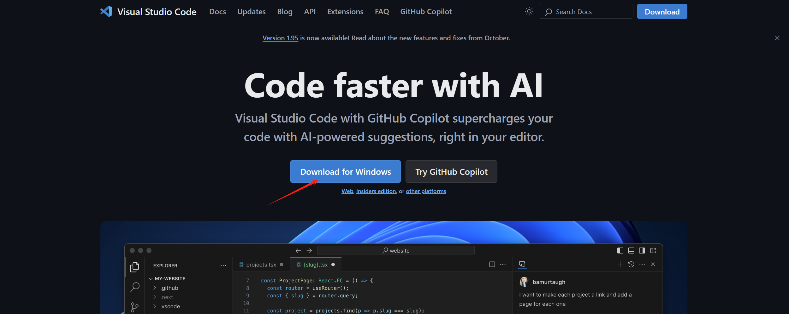

双击下载的 VSCodeUserSetup-x64-1.95.1.exe

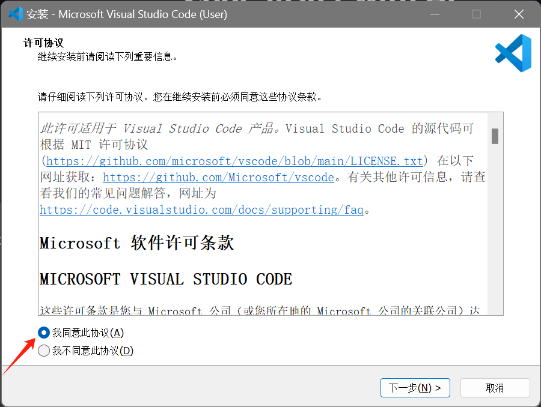

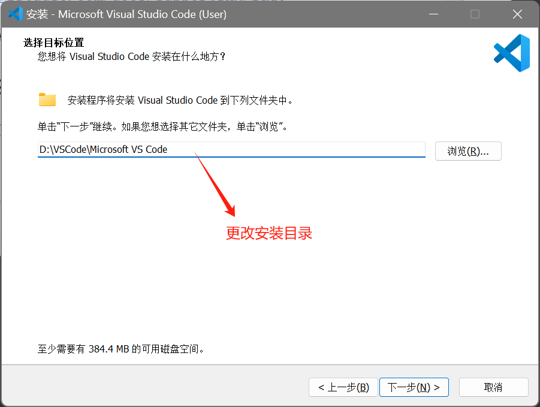

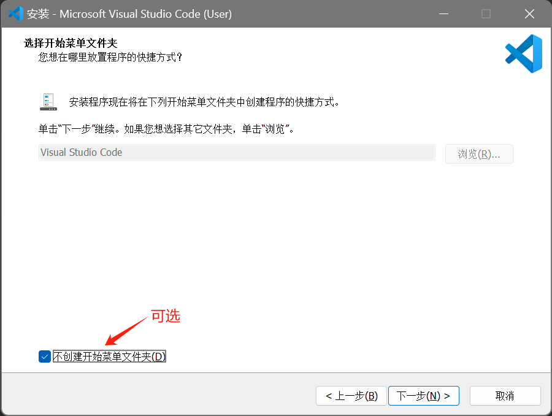

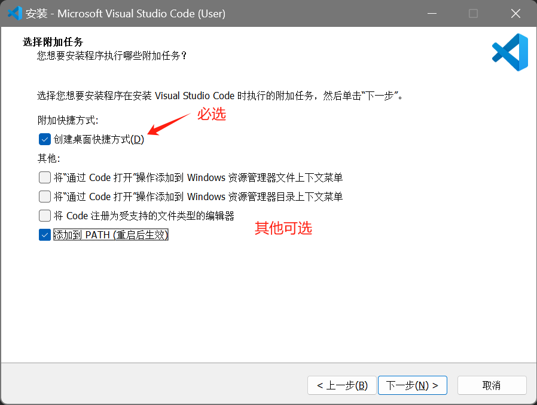

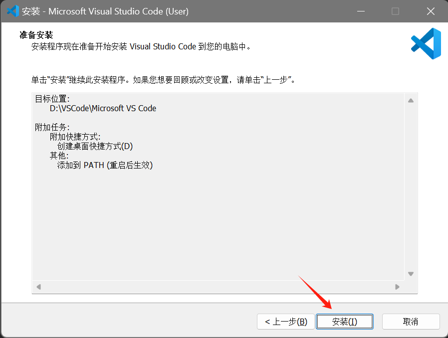

打开 VSCode，先汉化

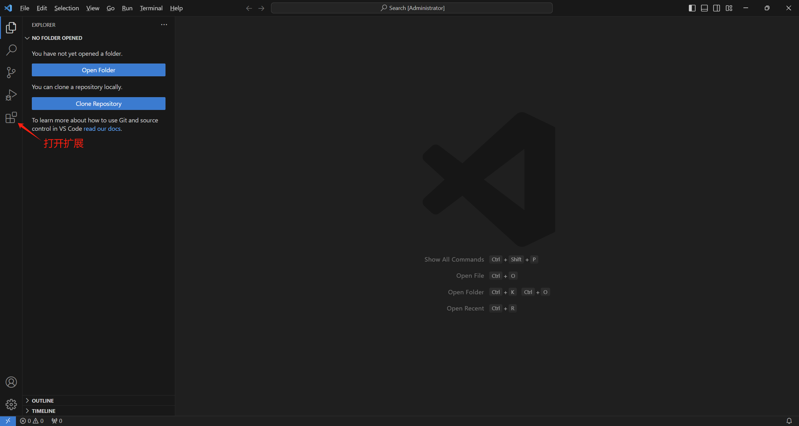

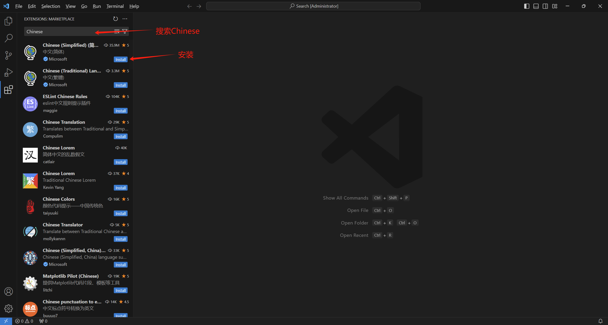

安装完毕重启VSCode即可

再点击拓展，搜索 ssh，安装 Remote - SSH 插件

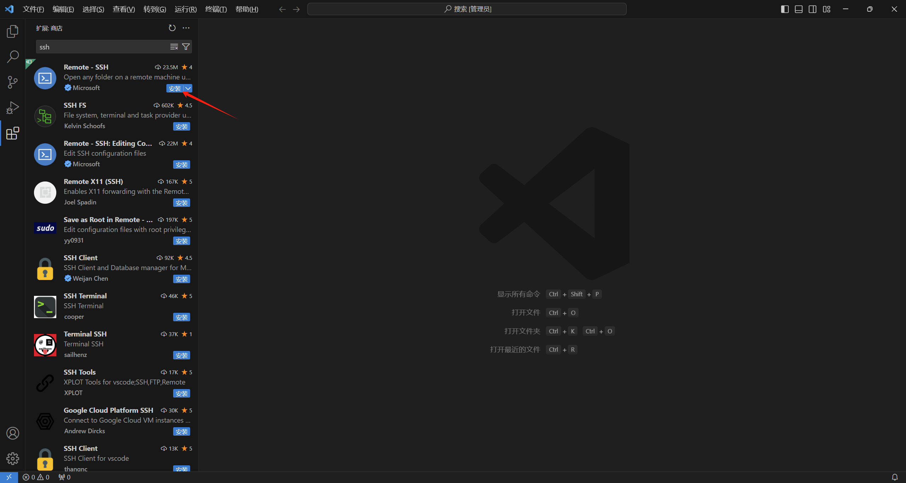

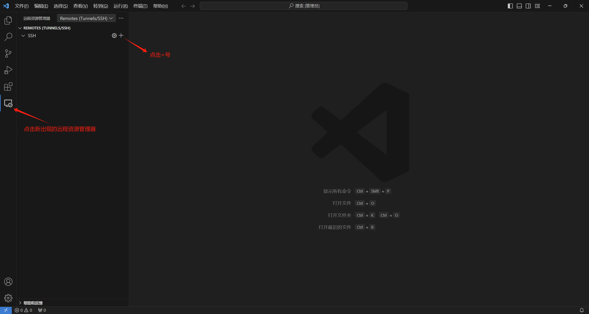


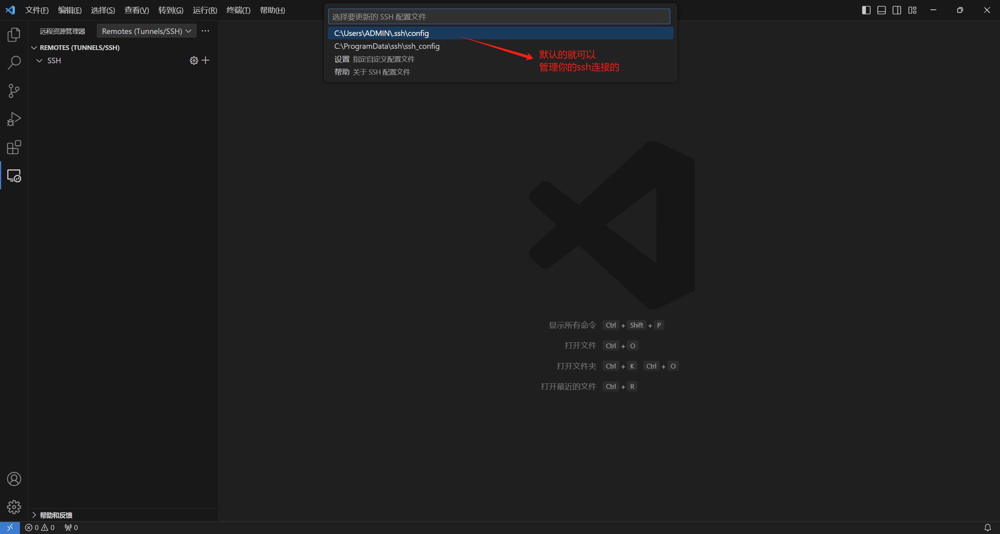

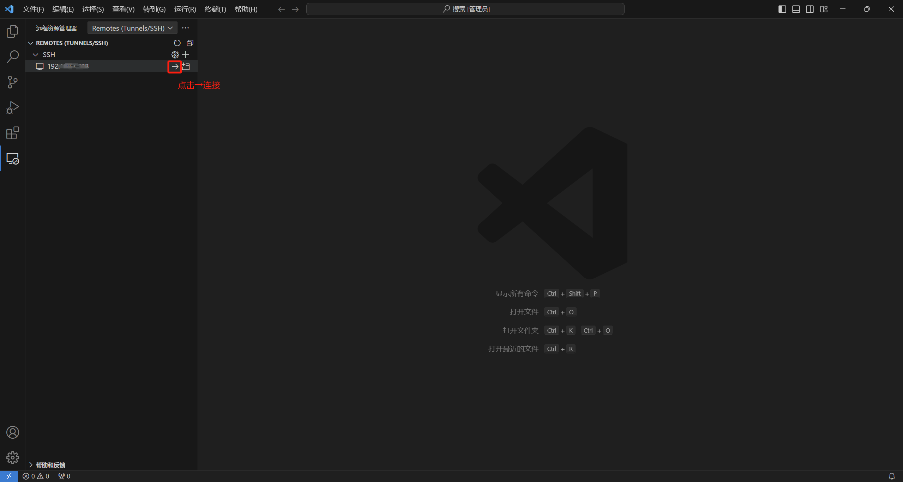

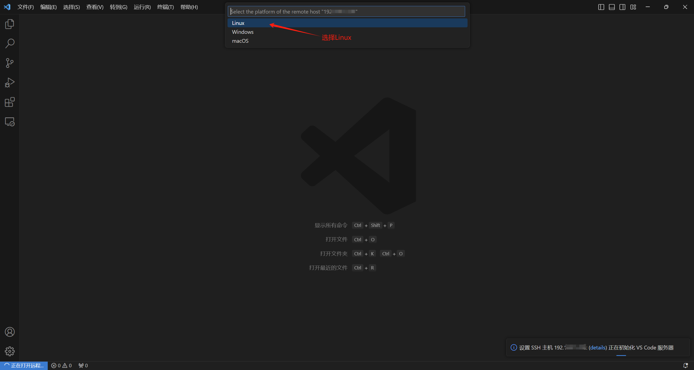

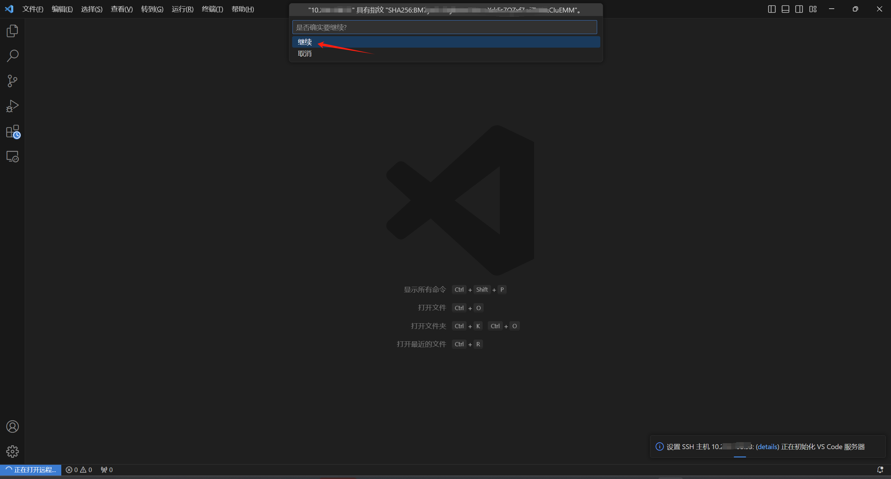

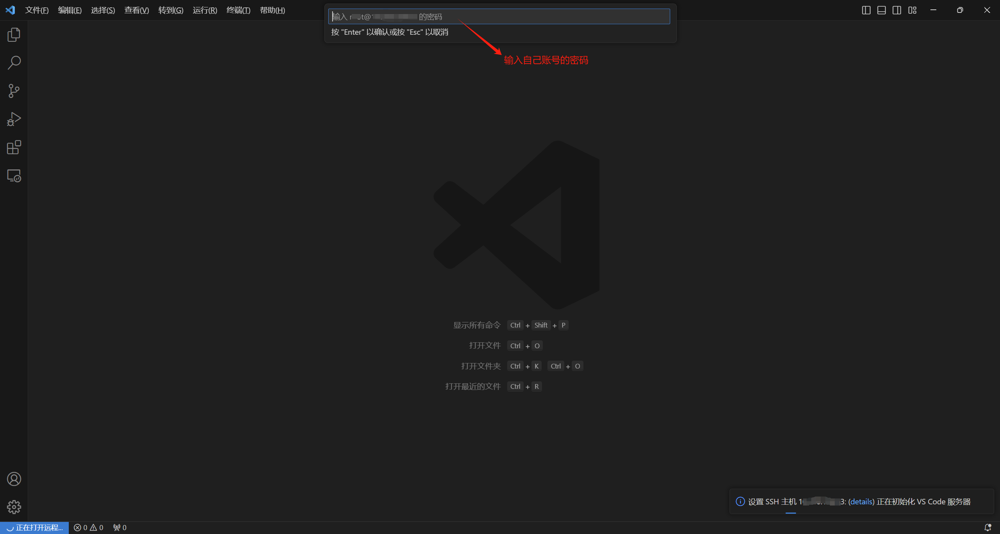

等待......

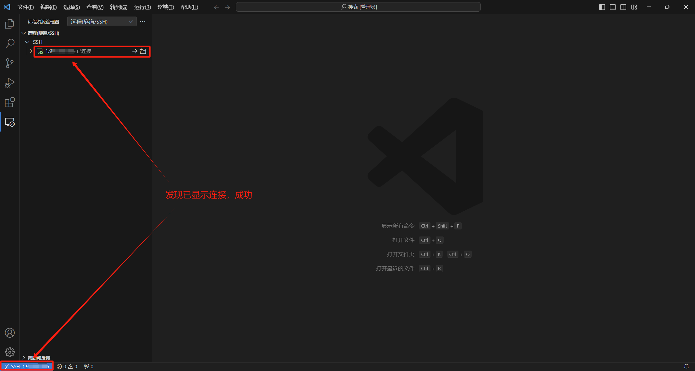

此时，我们再打开文件夹，就是服务器上的目录列表了

修改文件、创建文件等操作都是同步的，本地的修改会马上同步到服务器


如果你想断开远程连接，点击左下角，选择关闭远程连接

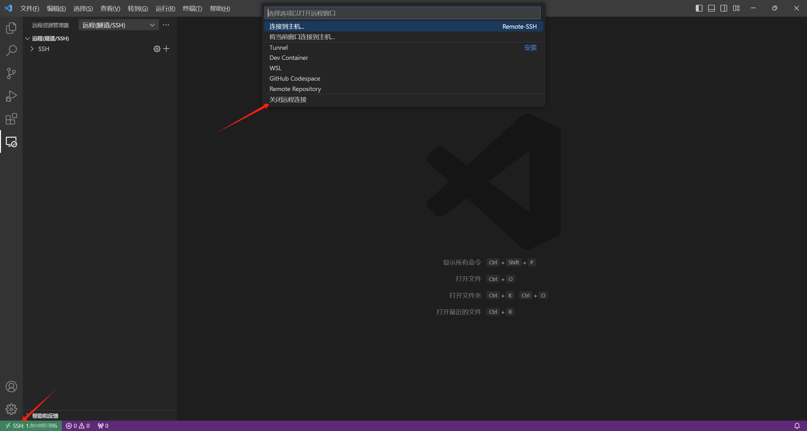


> [!NOTE]
>
> 如果你要删除ssh配置或者重新配置，别忘了你之前设置存储ssh配置文件的路径（默认是在C:\Users\ADMIN\.ssh），删除config、known_hosts、known_hosts.old 文件即可。


！！！好了，愉快地进行开发吧

如果对您有帮助，点个Star鼓励下！

